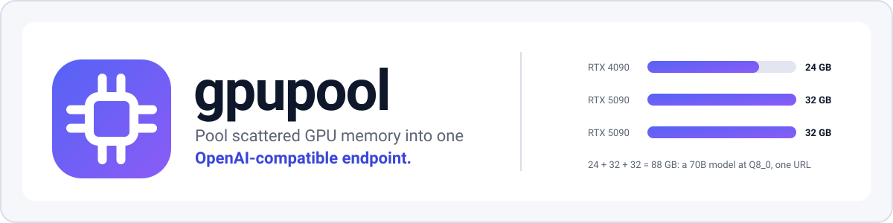
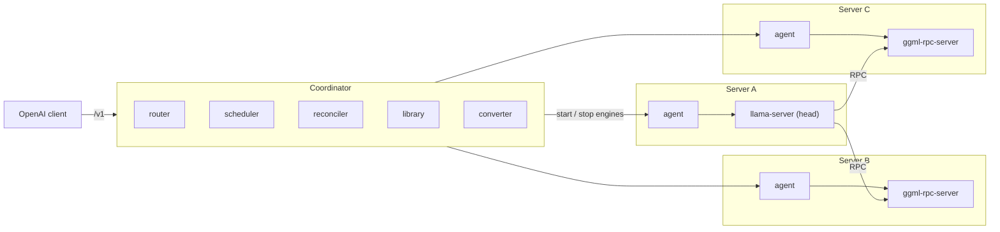

<div align="center">

<picture>
  <source media="(prefers-color-scheme: dark)" srcset="docs/assets/banner-dark.svg">
  <source media="(prefers-color-scheme: light)" srcset="docs/assets/banner-light.svg">
  
</picture>

**English** | [Tiếng Việt](README.vi.md)

[](https://github.com/longduongbao29/gpupool/actions/workflows/docker.yml)
[](LICENSE)
[](pyproject.toml)
[](https://github.com/longduongbao29?tab=packages&repo_name=gpupool)
[](https://github.com/ggml-org/llama.cpp/releases/tag/b11413)
[](docs/API.en.md)

[Quick start](#quick-start) · [Features](#features) · [Architecture](#architecture) · [What fits](#what-fits-where) · [API](#using-the-api) · [Docs](#documentation) · [FAQ](#faq)

</div>

---

You have an RTX 4090 in one box and two RTX 5090s in others, and a 70B model that fits on none of them alone.
**gpupool** measures the free VRAM on every machine, decides where each model goes and how its layers are split,
launches and supervises the engines, and gives you **one OpenAI-compatible URL**. The engine is
[llama.cpp](https://github.com/ggml-org/llama.cpp) (`llama-server` and `ggml-rpc-server`, GGUF models); gpupool is the
control plane on top of it.

## Why gpupool

- **The problem.** Free GPU memory is scattered: a few GB here, a few GB there, on shared servers where other people
  also run jobs. No single card fits the model you want.
- **The approach.** Treat the cluster as one pool. A model is split by layers across GPUs and servers over llama.cpp
  RPC; the scheduler picks the placement and the reconciler keeps it alive.
- **Made for shared servers.** User space only (no sudo), mixed CUDA versions, VRAM that other people use too.
- **Boring to operate.** One `docker run` for the coordinator, one per GPU server, then point any OpenAI client at it.

## Features

<table>
<tr>
<td width="33%" valign="top">

**Placement and scoring**<br>
Candidates (one GPU, one server, subsets of servers) are ranked by estimated decode speed. The winner is stored
with its reasons and shown in the UI.

</td>
<td width="33%" valign="top">

**Many models at once**<br>
Priority and preemption, autoscaling including scale-to-zero with cold start on the next request.

</td>
<td width="33%" valign="top">

**Make-before-break rebalancing**<br>
When a better placement exists, the new replica is ready before the old one stops.

</td>
</tr>
<tr>
<td valign="top">

**KV cache: quantized, shared, sized right**<br>
`f16`, `q8_0`, `q4_0`; one pool shared by the slots; estimates follow each model's real cache layout
(sliding window, MLA, hybrid).

</td>
<td valign="top">

**Speculative decoding**<br>
`ngram`, a `draft` model or the model's own `mtp` layers, to cut RPC round trips when a model is split.

</td>
<td valign="top">

**Recommend, capacity, what-if**<br>
`/api/recommend`, `/api/capacity` and `/api/simulate` answer "what fits" and "what would happen" without changing anything.

</td>
</tr>
<tr>
<td valign="top">

**Hugging Face to GGUF**<br>
Convert safetensors / PyTorch models inside the coordinator: quantization picker (Q8_0 to Q2_K and IQ1/IQ2/IQ3),
importance matrices, size and VRAM estimates, validation before the file enters the library.

</td>
<td valign="top">

**Per-model limits**<br>
Restrict a model to some servers or GPUs (a whole server, including GPUs added later, or single GPUs); the scheduler
still chooses among the allowed ones.

</td>
<td valign="top">

**RPC firewall**<br>
Each agent restricts its `ggml-rpc-server` port (iptables) to the head and itself.

</td>
</tr>
<tr>
<td valign="top">

**VRAM self-calibration**<br>
Measured engine buffers correct the memory estimate; the factor is persisted.

</td>
<td valign="top">

**Crash recovery**<br>
Control state lives in SQLite and survives coordinator restarts, including launches interrupted by a crash.

</td>
<td valign="top">

**Web UI and Docker images**<br>
Servers, GPUs, models, deployments, recommendations, events, and a Playground that streams a deployed model's replies with
their time to first token and tokens/s. Images build without GitHub access and behind HTTP proxies.

</td>
</tr>
</table>

## Architecture



A model is split **by layers**: the head (`llama-server`) runs some layers locally and offloads the others to
`ggml-rpc-server` processes on other servers. Only the head needs the GGUF file; the RPC servers hold just a tensor
cache.

<details>
<summary><b>What each component does</b></summary>

- **agent** (one per server): reports GPUs via NVML, starts and stops llama.cpp processes, caches GGUF files, applies the RPC firewall.
- **scheduler**: reads the GGUF header (no full download), estimates memory per layer, builds candidate placements
  (one GPU, one server, subsets of servers; GPUs before CPU RAM) and scores them by estimated decode speed.
- **router**: `/v1/chat/completions`, `/v1/completions`, `/v1/models`, streaming, prefix-aware load balancing
  (shared system prompts hit the replica that has them cached), retry before the first byte.
- **reconciler**: keeps the desired replica count, rolls back failed launches, fails over dead nodes, drains,
  autoscales, preempts and rebalances.

Design: [DESIGN](docs/DESIGN.en.md), [PLATFORM_DESIGN](docs/PLATFORM_DESIGN.en.md).

</details>

## What fits where

Big models stop being a single-card problem. A few examples of what gpupool can place on consumer flagships,
GPU by GPU, with every card keeping gpupool's default 10 % reserve (RTX 4090 ~21.6 GiB usable, RTX 5090 ~28.8 GiB):

| Model | Quant | GGUF file | VRAM at 8k context (GiB) | Fits on |
| --- | --- | --- | --- | --- |
| Qwen2.5-32B-Instruct | `Q4_K_M` | 19.8 GB | 20.7 | one RTX 4090 |
| Qwen2.5-32B-Instruct | `Q8_0` | 34.9 GB | 34.8 | RTX 4090 + RTX 5090 |
| Llama-3.3-70B-Instruct | `Q4_K_M` | 42.4 GB | 42.3 | 2 × RTX 4090, or 2 × RTX 5090 with room for a longer context |
| Qwen2.5-72B-Instruct | `Q4_K_M` | 49.1 GB | 48.5 | RTX 4090 + RTX 5090 |
| Llama-3.3-70B-Instruct | `Q6_K` | 57.9 GB | 56.8 | 2 × RTX 5090, or 3 × RTX 4090 |
| Llama-3.3-70B-Instruct | `Q8_0` | 75.1 GB | 72.8 | RTX 4090 + 2 × RTX 5090, or 4 × RTX 4090 |

Sizes come from gpupool's own estimator, the one the convert dialog and the recommendations use. It matches published
`Q4_K_M` files of Qwen2.5-32B, Llama-3.3-70B and Qwen2.5-72B within 4 %. The scheduler then plans with the real GGUF
header and corrects itself from the memory the engines actually allocate. Whether a split goes over PCIe inside one
server or over the network between servers, gpupool picks the fastest placement that fits.

## Quick start

Full guide: [docs/QUICKSTART.en.md](docs/QUICKSTART.en.md).

```bash
# 1. Coordinator (any machine, no GPU needed). The log prints the admin key; open http://<its IP>:8080
docker run -d --name gpupool --restart unless-stopped -p 8080:8080 -v gpupool:/data \
  ghcr.io/longduongbao29/gpupool-coordinator
docker logs gpupool

# 2. Each GPU server: run the join command shown in the UI (Servers -> Add Server)
docker run -d --name gpupool-agent --restart unless-stopped --gpus all --network host --pid host \
  -v gpupool-agent:/data -e GPUPOOL_JOIN="http://10.0.0.1:8080#<cluster-token>" \
  ghcr.io/longduongbao29/gpupool-agent

# 3. In the UI: Models -> Add model (Hugging Face or path) -> New model -> Start. Then:
curl http://10.0.0.1:8080/v1/chat/completions -H "Content-Type: application/json" \
  -d '{"model": "llama-70b", "messages": [{"role": "user", "content": "Hello"}]}'
```

GPU servers need an NVIDIA driver 525 or newer (570 or newer for RTX 50-series), Docker and the NVIDIA Container Toolkit.

<details>
<summary><b>Try it on one machine (simulated 3-server cluster)</b></summary>

`docker-compose.sim.yml` starts a coordinator and three "servers" joined exactly like a real install, so you can try the
UI, multi-server placement and RPC splits with a single GPU. Build both images first (see the quick start guide), then:

```bash
GPUPOOL_HOST_MODELS_DIR=/srv/gguf docker compose -f docker-compose.sim.yml up -d
```

UI at `http://<docker host>:8080`, admin key `sim-admin`. Stop and wipe with
`docker compose -f docker-compose.sim.yml down -v`.

</details>

<details>
<summary><b>Serve a model that has no GGUF (4 steps)</b></summary>

1. **Models -> Convert a model**, choose a Hugging Face repo (`owner/name`) or a folder on the server.
2. **Inspect**: nothing is downloaded yet; you see the architecture, whether the pinned converter supports it, and the
   estimated size and VRAM for each quantization type.
3. Pick a **quantization type** and **Start conversion**. Stages: download, convert, calibrate (only when an importance
   matrix is computed), quantize, validate.
4. When the job is done the file is in the library: **Deploy this model**.

Prefer a ready-made GGUF when one exists: it is faster and needs no conversion. Details and the HTTP equivalent:
[QUICKSTART](docs/QUICKSTART.en.md#serving-a-model-that-has-no-gguf-convert), [API](docs/API.en.md).

</details>

## Using the API

Any OpenAI-compatible client works; only the base URL and the model name change.

```python
from openai import OpenAI

client = OpenAI(base_url="http://10.0.0.1:8080/v1", api_key="none")
r = client.chat.completions.create(model="llama-70b", messages=[{"role": "user", "content": "Hello"}])
print(r.choices[0].message.content)
```

Streaming (`stream: true`) is supported. To require a key, start the coordinator with `-e GPUPOOL_API_KEYS=key1,key2`.
The management API (models, servers, recommend, capacity, simulate, convert, state, events) is documented in
[docs/API.en.md](docs/API.en.md).

## Documentation

| Document | English | Tiếng Việt |
| --- | --- | --- |
| Quick start and deployment | [QUICKSTART.en.md](docs/QUICKSTART.en.md) | [QUICKSTART.vi.md](docs/QUICKSTART.vi.md) |
| HTTP API reference | [API.en.md](docs/API.en.md) | [API.vi.md](docs/API.vi.md) |
| Design | [DESIGN.en.md](docs/DESIGN.en.md) | [DESIGN.vi.md](docs/DESIGN.vi.md) |
| Platform design (multi-model scheduling) | [PLATFORM_DESIGN.en.md](docs/PLATFORM_DESIGN.en.md) | [PLATFORM_DESIGN.vi.md](docs/PLATFORM_DESIGN.vi.md) |
| UI design | [UI_DESIGN.en.md](docs/UI_DESIGN.en.md) | [UI_DESIGN.vi.md](docs/UI_DESIGN.vi.md) |
| Test report | [TEST_REPORT.en.md](docs/TEST_REPORT.en.md) | [TEST_REPORT.vi.md](docs/TEST_REPORT.vi.md) |

<details>
<summary><b>Running the tests</b></summary>

```bash
uv run pytest                 # unit tests
uv run pytest -m real         # needs llama.cpp in .cache/llama/b11342-cuda12.4 and a GGUF in .cache/models
uv run python scripts/e2e_local.py   # 3 emulated nodes on one machine, real llama.cpp

# CI end-to-end: coordinator + 3 CPU-only agents (docker-compose.ci.yml)
uv run python scripts/ci_e2e.py [--project gpupool-ci] [--port 8080] [--keep] [--skip-convert]
```

`scripts/ci_e2e.py` needs the `gpupool-agent` and `gpupool-coordinator` images (override with `GPUPOOL_AGENT_IMAGE` /
`GPUPOOL_COORDINATOR_IMAGE`); in GitHub Actions it is the `e2e` job. The conversion stage needs internet access to
huggingface.co; `--skip-convert` leaves it out.

</details>

## Roadmap

From the "still to do" and open-question lists in the [test report](docs/TEST_REPORT.en.md) and the
[platform design](docs/PLATFORM_DESIGN.en.md#10-open-questions-and-decisions).

- [ ] Run on a real multi-server LAN, and measure speculative decoding (n-gram, draft, MTP), one RPC server per
  multi-GPU server and RDMA over a real network
- [ ] Per-client API keys and quotas, `/v1/embeddings`, TLS
- [ ] Zero-downtime model swap
- [x] Upgrade llama.cpp (b11342 → b11413)
- [ ] Decode-speed model per GPU architecture (today a single fixed efficiency of 0.5) and a separate prefill score
- [ ] Importance matrices on GPU servers; distributing conversion jobs over several machines
- [ ] LoRA adapters and vision projectors (`mmproj`) in conversion

## FAQ

<details>
<summary><b>Do all servers need the model file?</b></summary>

No. Only the head (`llama-server`) holds the GGUF. In the simulated cluster, a 2.1 GB model was held by the head only,
while the RPC server held a tensor cache of about 724 MB. That cache lives on the agent's `/data` volume, so the next
load of the model sends almost nothing over the network, and is capped at `GPUPOOL_RPC_CACHE_GB` (100 GB).

</details>

<details>
<summary><b>How fast is a model split over the network?</b></summary>

Every generated token crosses each RPC link once, so latency matters more than bandwidth. gpupool keeps the hops
down: one GPU or one server is preferred whenever the model fits, the GPUs a replica uses inside one remote server sit
behind a single RPC server (activations between them never leave that machine), speculative decoding (n-gram, a
draft model, or the model's own MTP layers) cuts the number of passes per token, and the agent image uses RDMA
(InfiniBand / RoCE) when the servers have it. See [Network](docs/QUICKSTART.en.md#network).

</details>

<details>
<summary><b>Which GPUs and drivers?</b></summary>

NVIDIA GPUs from Pascal to Blackwell: the agent image is built on CUDA 12.8 for architectures 61, 70, 75, 80, 86, 89,
90 and 120, so GTX 10-series through RTX 4090/5090, A100/H100 and RTX PRO 6000 Blackwell are covered. Driver 525 or
newer (RTX 50-series cards need 570 or newer). GPU servers need Docker and the NVIDIA Container Toolkit.

</details>

<details>
<summary><b>Does it work without Docker?</b></summary>

Yes: `uv run gpupool coordinator`, and on each GPU server
`uv run gpupool agent --join "http://10.0.0.1:8080#<cluster-token>" --llama-dir <llama.cpp build/bin>`.
The agent needs a llama.cpp b11413 build with CUDA and RPC. See "Without Docker" in the
[quick start](docs/QUICKSTART.en.md).

</details>

<details>
<summary><b>Can I serve safetensors models?</b></summary>

Yes, by converting them to GGUF in the coordinator (UI or `/api/convert`). Support depends on the pinned converter
(llama.cpp b11413): an unsupported architecture is reported at the inspect step. LoRA adapters and vision projectors
are not converted yet.

</details>

<details>
<summary><b>Is it secure on a public network?</b></summary>

Not by itself. llama.cpp RPC ports are unauthenticated and unencrypted (gpupool's RPC firewall restricts them), the
cluster token and API keys travel over plain HTTP, and `/v1` is open unless you set `GPUPOOL_API_KEYS`. Keep the cluster
on a private network or VPN, and put a TLS-terminating proxy in front of the coordinator for outside clients. See
[Security](docs/QUICKSTART.en.md#security) and [SECURITY.md](SECURITY.md).

</details>

<details>
<summary><b>Can I mix different GPUs?</b></summary>

Yes. The scheduler reads each GPU's memory and ranks placements by estimated decode speed using memory bandwidth,
network hops and GPU sharing (for MoE models, only the experts a token reads count). The estimate uses one fixed
efficiency for every GPU, so treat its tok/s figures as a ranking,
not a promise. Spreading over real multi-GPU, multi-server hardware is verified only with
simulated agents.

</details>

<details>
<summary><b>Does it run on Windows?</b></summary>

It was developed and tested on Windows 11: natively with emulated nodes, and with Docker in WSL2 for the simulated
cluster (see the WSL2 notes in the quick start troubleshooting). The documented deployment target for GPU servers is
Docker with the NVIDIA Container Toolkit. A real Windows multi-server cluster has not been tried.

</details>

## Community

[Contributing](CONTRIBUTING.md) · [Code of conduct](CODE_OF_CONDUCT.md) · [Security policy](SECURITY.md) · [Changelog](CHANGELOG.md)

## License

[MIT](LICENSE), © 2026 Long Duong. Models you serve keep their own licenses; see [THIRD_PARTY_NOTICES.md](THIRD_PARTY_NOTICES.md).

## Acknowledgements

- [llama.cpp](https://github.com/ggml-org/llama.cpp) and [ggml](https://github.com/ggml-org/ggml): the inference engine and the RPC backend that make pooling possible.
- [Hugging Face](https://huggingface.co): model hosting and the formats gpupool converts from.
- [FastAPI](https://fastapi.tiangolo.com): the HTTP services of the coordinator and the agent.
- [Alpine.js](https://alpinejs.dev): the web UI.
