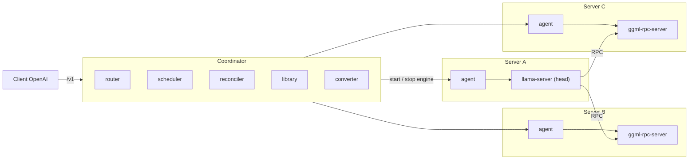

<div align="center">

<picture>
  <source media="(prefers-color-scheme: dark)" srcset="docs/assets/banner-dark.svg">
  <source media="(prefers-color-scheme: light)" srcset="docs/assets/banner-light.svg">
  
</picture>

[English](README.md) | **Tiếng Việt**

[](https://github.com/longduongbao29/gpupool/actions/workflows/docker.yml)
[](LICENSE)
[](pyproject.toml)
[](https://github.com/longduongbao29?tab=packages&repo_name=gpupool)
[](https://github.com/ggml-org/llama.cpp/releases/tag/b11342)
[](docs/API.vi.md)

[Bắt đầu nhanh](#bắt-đầu-nhanh) · [Tính năng](#tính-năng) · [Kiến trúc](#kiến-trúc) · [Vừa ở đâu](#model-nào-vừa-ở-đâu) · [API](#dùng-api) · [Tài liệu](#tài-liệu) · [Hỏi đáp](#hỏi-đáp)

</div>

---

Bạn có một RTX 4090 ở máy này và hai RTX 5090 ở máy khác, cùng một model 70B không card nào chứa nổi một mình.
**gpupool** đo VRAM trống trên từng máy, quyết định mỗi model đặt ở đâu và chia các layer ra sao, khởi chạy và giám sát
các engine, rồi đưa cho bạn **một URL tương thích OpenAI**. Engine là
[llama.cpp](https://github.com/ggml-org/llama.cpp) (`llama-server` và `ggml-rpc-server`, model GGUF); gpupool là lớp
điều khiển nằm phía trên.

## Vì sao chọn gpupool

- **Vấn đề.** VRAM trống nằm rải rác: vài GB chỗ này, vài GB chỗ kia, trên các server dùng chung nơi người khác cũng
  chạy tác vụ. Không có card nào đủ chỗ cho model bạn muốn.
- **Cách tiếp cận.** Coi cả cụm là một pool. Model được chia theo layer qua nhiều GPU và nhiều server bằng llama.cpp
  RPC; scheduler chọn vị trí đặt, reconciler giữ cho nó chạy.
- **Dành cho server dùng chung.** Chỉ cần user space (không cần sudo), chịu được nhiều phiên bản CUDA khác nhau, và
  VRAM mà người khác cũng đang dùng.
- **Vận hành đơn giản.** Một lệnh `docker run` cho coordinator, một lệnh cho mỗi server GPU, rồi trỏ client OpenAI bất kỳ vào.

## Tính năng

<table>
<tr>
<td width="33%" valign="top">

**Đặt model và chấm điểm**<br>
Các phương án (một GPU, một server, tập con các server) được xếp hạng theo tốc độ decode ước tính. Phương án thắng
được lưu cùng lý do và hiển thị trên UI.

</td>
<td width="33%" valign="top">

**Nhiều model cùng lúc**<br>
Độ ưu tiên và preemption, autoscaling kể cả về 0 replica (cold start ở request kế tiếp).

</td>
<td width="33%" valign="top">

**Rebalance make-before-break**<br>
Khi có phương án đặt tốt hơn, replica mới sẵn sàng rồi replica cũ mới dừng.

</td>
</tr>
<tr>
<td valign="top">

**Lượng tử hóa KV cache**<br>
`f16`, `q8_0`, `q4_0` để model vừa với ít GPU hơn.

</td>
<td valign="top">

**Speculative decoding**<br>
`ngram` hoặc model `draft`, giảm số vòng RPC khi model bị chia ra nhiều server.

</td>
<td valign="top">

**Đề xuất, dung lượng, giả lập**<br>
`/api/recommend`, `/api/capacity`, `/api/simulate` trả lời "cái gì còn vừa" và "nếu làm vậy thì sao" mà không đổi gì.

</td>
</tr>
<tr>
<td valign="top">

**Hugging Face sang GGUF**<br>
Chuyển model safetensors / PyTorch ngay trong coordinator: chọn kiểu lượng tử (Q8_0 đến Q2_K và IQ1/IQ2/IQ3),
importance matrix, ước tính dung lượng file và VRAM, kiểm tra hợp lệ trước khi file vào thư viện.

</td>
<td valign="top">

**Giới hạn theo model**<br>
Chỉ cho một model chạy trên một số server hoặc GPU (cả server, kể cả GPU thêm sau này, hoặc từng GPU); scheduler vẫn
chọn vị trí trong tập được phép.

</td>
<td valign="top">

**Firewall cho RPC**<br>
Mỗi agent giới hạn cổng `ggml-rpc-server` (iptables) chỉ cho head và chính nó.

</td>
</tr>
<tr>
<td valign="top">

**Tự hiệu chỉnh VRAM**<br>
Buffer engine đo được dùng để sửa ước tính bộ nhớ; hệ số được lưu bền.

</td>
<td valign="top">

**Phục hồi sau sự cố**<br>
Trạng thái điều khiển nằm trong SQLite, còn nguyên khi coordinator khởi động lại, kể cả các lần khởi chạy bị gián đoạn.

</td>
<td valign="top">

**Giao diện web và image Docker**<br>
Server, GPU, model, deployment, đề xuất, sự kiện. Image build được khi không có GitHub và sau HTTP proxy.

</td>
</tr>
</table>

## Kiến trúc



Model được chia **theo layer**: head (`llama-server`) chạy một số layer tại chỗ và đẩy các layer còn lại sang các tiến
trình `ggml-rpc-server` trên server khác. Chỉ head cần file GGUF; các RPC server chỉ giữ một cache tensor.

<details>
<summary><b>Từng thành phần làm gì</b></summary>

- **agent** (một cái trên mỗi server): báo cáo GPU qua NVML, khởi động và dừng các tiến trình llama.cpp, cache file GGUF, áp dụng firewall RPC.
- **scheduler**: đọc header GGUF (không cần tải cả file), ước tính bộ nhớ theo từng layer, dựng các phương án đặt
  (một GPU, một server, tập con các server; GPU trước RAM CPU) và chấm điểm theo tốc độ decode ước tính.
- **router**: `/v1/chat/completions`, `/v1/completions`, `/v1/models`, streaming, cân bằng tải theo prefix (system
  prompt dùng chung sẽ vào replica đã cache nó), thử lại trước byte đầu tiên.
- **reconciler**: giữ đúng số replica mong muốn, rollback các lần khởi chạy lỗi, failover khi node chết, drain,
  autoscale, preempt và rebalance.

Thiết kế: [DESIGN](docs/DESIGN.vi.md), [PLATFORM_DESIGN](docs/PLATFORM_DESIGN.vi.md).

</details>

## Model nào vừa ở đâu

Model lớn không còn là chuyện của một card. Vài ví dụ gpupool có thể đặt lên các card flagship, chia theo từng GPU,
mỗi card vẫn giữ lại 10 % mặc định của gpupool (RTX 4090 dùng được ~21,6 GiB, RTX 5090 ~28,8 GiB):

| Model | Lượng tử | File GGUF | VRAM ở ngữ cảnh 8k (GiB) | Vừa trên |
| --- | --- | --- | --- | --- |
| Qwen2.5-32B-Instruct | `Q4_K_M` | 19,8 GB | 20,7 | một RTX 4090 |
| Qwen2.5-32B-Instruct | `Q8_0` | 34,9 GB | 34,8 | RTX 4090 + RTX 5090 |
| Llama-3.3-70B-Instruct | `Q4_K_M` | 42,4 GB | 42,3 | 2 × RTX 4090, hoặc 2 × RTX 5090 để có ngữ cảnh dài hơn |
| Qwen2.5-72B-Instruct | `Q4_K_M` | 49,1 GB | 48,5 | RTX 4090 + RTX 5090 |
| Llama-3.3-70B-Instruct | `Q6_K` | 57,9 GB | 56,8 | 2 × RTX 5090, hoặc 3 × RTX 4090 |
| Llama-3.3-70B-Instruct | `Q8_0` | 75,1 GB | 72,8 | RTX 4090 + 2 × RTX 5090, hoặc 4 × RTX 4090 |

Kích thước lấy từ bộ ước lượng của chính gpupool, cũng là bộ mà hộp thoại convert và phần gợi ý dùng. Nó khớp với các
file `Q4_K_M` đã công bố của Qwen2.5-32B, Llama-3.3-70B và Qwen2.5-72B trong vòng 4 %. Sau đó scheduler lập kế hoạch
bằng header GGUF thật và tự hiệu chỉnh theo bộ nhớ mà engine thực sự cấp phát. Dù phần chia đi qua PCIe trong một server
hay qua mạng giữa các server, gpupool chọn phương án nhanh nhất mà vẫn vừa.

## Bắt đầu nhanh

Hướng dẫn đầy đủ: [docs/QUICKSTART.vi.md](docs/QUICKSTART.vi.md).

```bash
# 1. Coordinator (máy bất kỳ, không cần GPU). Log in ra admin key; mở http://<IP máy này>:8080
docker run -d --name gpupool --restart unless-stopped -p 8080:8080 -v gpupool:/data \
  ghcr.io/longduongbao29/gpupool-coordinator
docker logs gpupool

# 2. Mỗi server GPU: chạy lệnh join hiển thị trên UI (Servers -> Add Server)
docker run -d --name gpupool-agent --restart unless-stopped --gpus all --network host --pid host \
  -v gpupool-agent:/data -e GPUPOOL_JOIN="http://10.0.0.1:8080#<cluster-token>" \
  ghcr.io/longduongbao29/gpupool-agent

# 3. Trên UI: Models -> Add model (Hugging Face hoặc đường dẫn) -> New model -> Start. Sau đó:
curl http://10.0.0.1:8080/v1/chat/completions -H "Content-Type: application/json" \
  -d '{"model": "llama-70b", "messages": [{"role": "user", "content": "Xin chào"}]}'
```

Server GPU cần driver NVIDIA 525 trở lên, Docker và NVIDIA Container Toolkit.

<details>
<summary><b>Thử trên một máy (cụm 3 server giả lập)</b></summary>

`docker-compose.sim.yml` chạy một coordinator và ba "server" tham gia đúng như bản cài thật, nên bạn có thể thử UI,
việc đặt model trên nhiều server và chia RPC chỉ với một GPU. Build cả hai image trước (xem hướng dẫn bắt đầu nhanh), rồi:

```bash
GPUPOOL_HOST_MODELS_DIR=/srv/gguf docker compose -f docker-compose.sim.yml up -d
```

UI ở `http://<docker host>:8080`, admin key `sim-admin`. Dừng và xóa sạch bằng
`docker compose -f docker-compose.sim.yml down -v`.

</details>

<details>
<summary><b>Serve model chưa có GGUF (4 bước)</b></summary>

1. **Models -> Convert a model**, chọn repo Hugging Face (`owner/name`) hoặc một thư mục trên server.
2. **Inspect**: chưa tải gì cả; bạn thấy kiến trúc, converter đã ghim có hỗ trợ không, và ước tính dung lượng cùng
   VRAM cho từng kiểu lượng tử.
3. Chọn **kiểu lượng tử** rồi **Start conversion**. Các giai đoạn: tải, chuyển đổi, calibrate (chỉ khi tính importance
   matrix), lượng tử hóa, kiểm tra.
4. Khi job xong, file nằm trong thư viện: **Deploy this model**.

Nếu đã có sẵn bản GGUF thì nên dùng nó: nhanh hơn và không cần chuyển đổi. Chi tiết và cách gọi qua HTTP:
[QUICKSTART](docs/QUICKSTART.vi.md#serve-model-chưa-có-gguf-chuyển-đổi), [API](docs/API.vi.md).

</details>

## Dùng API

Mọi client tương thích OpenAI đều dùng được; chỉ đổi base URL và tên model.

```python
from openai import OpenAI

client = OpenAI(base_url="http://10.0.0.1:8080/v1", api_key="none")
r = client.chat.completions.create(model="llama-70b", messages=[{"role": "user", "content": "Xin chào"}])
print(r.choices[0].message.content)
```

Hỗ trợ streaming (`stream: true`). Muốn bắt buộc client gửi key, chạy coordinator với `-e GPUPOOL_API_KEYS=key1,key2`.
API quản trị (models, servers, recommend, capacity, simulate, convert, state, events) được mô tả trong
[docs/API.vi.md](docs/API.vi.md).

## Tài liệu

| Tài liệu | English | Tiếng Việt |
| --- | --- | --- |
| Bắt đầu nhanh và triển khai | [QUICKSTART.en.md](docs/QUICKSTART.en.md) | [QUICKSTART.vi.md](docs/QUICKSTART.vi.md) |
| Tham chiếu HTTP API | [API.en.md](docs/API.en.md) | [API.vi.md](docs/API.vi.md) |
| Thiết kế | [DESIGN.en.md](docs/DESIGN.en.md) | [DESIGN.vi.md](docs/DESIGN.vi.md) |
| Thiết kế nền tảng (lập lịch nhiều model) | [PLATFORM_DESIGN.en.md](docs/PLATFORM_DESIGN.en.md) | [PLATFORM_DESIGN.vi.md](docs/PLATFORM_DESIGN.vi.md) |
| Thiết kế UI | [UI_DESIGN.en.md](docs/UI_DESIGN.en.md) | [UI_DESIGN.vi.md](docs/UI_DESIGN.vi.md) |
| Báo cáo kiểm thử | [TEST_REPORT.en.md](docs/TEST_REPORT.en.md) | [TEST_REPORT.vi.md](docs/TEST_REPORT.vi.md) |

<details>
<summary><b>Chạy test</b></summary>

```bash
uv run pytest                 # unit test
uv run pytest -m real         # cần llama.cpp trong .cache/llama/b11342-cuda12.4 và một file GGUF trong .cache/models
uv run python scripts/e2e_local.py   # 3 node giả lập trên một máy, llama.cpp thật

# End-to-end cho CI: coordinator + 3 agent chỉ CPU (docker-compose.ci.yml)
uv run python scripts/ci_e2e.py [--project gpupool-ci] [--port 8080] [--keep] [--skip-convert]
```

`scripts/ci_e2e.py` cần hai image `gpupool-agent` và `gpupool-coordinator` (ghi đè bằng `GPUPOOL_AGENT_IMAGE` /
`GPUPOOL_COORDINATOR_IMAGE`); trên GitHub Actions đó là job `e2e`. Giai đoạn chuyển đổi cần truy cập internet tới
huggingface.co; `--skip-convert` bỏ qua giai đoạn này.

</details>

## Lộ trình

Lấy từ các danh sách "còn phải làm" và câu hỏi mở trong [báo cáo kiểm thử](docs/TEST_REPORT.vi.md) và
[thiết kế nền tảng](docs/PLATFORM_DESIGN.vi.md#10-câu-hỏi-mở-và-các-quyết-định).

- [ ] Chạy trên mạng LAN nhiều server thật, và đo speculative decoding qua mạng thật
- [ ] API key và quota theo từng client, `/v1/embeddings`, TLS
- [ ] Đổi model không gián đoạn (zero-downtime)
- [ ] Nâng cấp llama.cpp
- [ ] Mô hình tốc độ decode theo từng kiến trúc GPU (hiện là một hiệu suất cố định 0,5) và điểm prefill riêng
- [ ] Importance matrix trên server GPU; phân tán các job chuyển đổi sang nhiều máy
- [ ] LoRA adapter và vision projector (`mmproj`) khi chuyển đổi

## Hỏi đáp

<details>
<summary><b>Mọi server đều cần file model không?</b></summary>

Không. Chỉ head (`llama-server`) giữ file GGUF. Trong cụm giả lập, model 2,1 GB chỉ nằm ở head, còn RPC server chỉ
giữ cache tensor khoảng 724 MB.

</details>

<details>
<summary><b>Hỗ trợ GPU và driver nào?</b></summary>

GPU NVIDIA với driver 525 trở lên. Image agent được build trên CUDA 12.4 cho các kiến trúc 61, 70, 75, 80, 86, 89 và
90. Server GPU cần Docker và NVIDIA Container Toolkit.

</details>

<details>
<summary><b>Chạy được mà không cần Docker không?</b></summary>

Được: `uv run gpupool coordinator`, và trên mỗi server GPU
`uv run gpupool agent --join "http://10.0.0.1:8080#<cluster-token>" --llama-dir <llama.cpp build/bin>`.
Agent cần bản build llama.cpp b11342 có CUDA và RPC. Xem mục "Không dùng Docker" trong
[hướng dẫn bắt đầu nhanh](docs/QUICKSTART.vi.md).

</details>

<details>
<summary><b>Serve được model safetensors không?</b></summary>

Được, bằng cách chuyển chúng sang GGUF trong coordinator (UI hoặc `/api/convert`). Việc hỗ trợ phụ thuộc converter đã
ghim (llama.cpp b11342): kiến trúc chưa được hỗ trợ sẽ được báo ở bước inspect. LoRA adapter và vision projector chưa
được chuyển đổi.

</details>

<details>
<summary><b>Có an toàn khi dùng trên mạng công cộng không?</b></summary>

Không tự thân. Cổng RPC của llama.cpp không có xác thực và không mã hóa (firewall RPC của gpupool giới hạn truy cập),
cluster token và API key đi qua HTTP thường, và `/v1` mở với mọi người trừ khi bạn đặt `GPUPOOL_API_KEYS`. Hãy giữ cụm
trong mạng riêng hoặc VPN, và đặt một proxy kết thúc TLS trước coordinator nếu client ở bên ngoài. Xem
[Bảo mật](docs/QUICKSTART.vi.md#bảo-mật) và [SECURITY.vi.md](SECURITY.vi.md).

</details>

<details>
<summary><b>Trộn các loại GPU khác nhau được không?</b></summary>

Được. Scheduler đọc bộ nhớ của từng GPU và xếp hạng các phương án theo tốc độ decode ước tính dựa trên băng thông bộ
nhớ, số chặng mạng và việc chia sẻ GPU. Ước tính dùng một hiệu suất cố định cho mọi GPU, nên hãy
xem các con số tok/s như thứ hạng, không phải cam kết. Việc dàn trải trên phần cứng nhiều GPU, nhiều server thật mới
chỉ được kiểm chứng bằng agent giả lập.

</details>

<details>
<summary><b>Có chạy trên Windows không?</b></summary>

Dự án được phát triển và kiểm thử trên Windows 11: chạy native với node giả lập, và Docker trong WSL2 cho cụm giả
lập (xem ghi chú WSL2 trong phần xử lý sự cố của hướng dẫn bắt đầu nhanh). Môi trường triển khai được tài liệu hóa
cho server GPU là Docker với NVIDIA Container Toolkit. Cụm Windows nhiều server thật chưa được thử.

</details>

## Cộng đồng

[Đóng góp](CONTRIBUTING.vi.md) · [Quy tắc ứng xử](CODE_OF_CONDUCT.vi.md) · [Chính sách bảo mật](SECURITY.vi.md) · [Nhật ký thay đổi](CHANGELOG.vi.md)

## Giấy phép

[MIT](LICENSE), © 2026 Long Duong. Các model bạn serve giữ giấy phép riêng của chúng; xem [THIRD_PARTY_NOTICES.vi.md](THIRD_PARTY_NOTICES.vi.md).

## Lời cảm ơn

- [llama.cpp](https://github.com/ggml-org/llama.cpp) và [ggml](https://github.com/ggml-org/ggml): engine suy luận và backend RPC giúp việc gom pool khả thi.
- [Hugging Face](https://huggingface.co): nơi lưu trữ model và các định dạng mà gpupool chuyển đổi từ đó.
- [FastAPI](https://fastapi.tiangolo.com): dịch vụ HTTP của coordinator và agent.
- [Alpine.js](https://alpinejs.dev): giao diện web.
