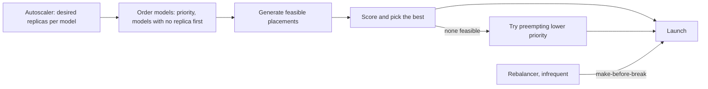

# gpupool — Multi-model, multi-server platform design (draft)

> English version. Vietnamese version: [PLATFORM_DESIGN.vi.md](PLATFORM_DESIGN.vi.md). Keep both in sync.

Goal: gpupool manages **many models on many servers and GPUs** at once, shares resources deliberately
(priority, spreading, load-based scaling) and **recommends GPUs/servers** for each model with reasons
and estimates. This document covers the measured current behaviour, the resource model, the allocation
algorithm, the API and a phased rollout.

## 1. Current behaviour with several models

Running the **real** reconciler and scheduler (fake agents, real GGUF metadata of Qwen2.5 0.5B = 587 MB
and 3B = 2191 MB at ctx 4096):

| Scenario | What happens today | Problem |
| --- | --- | --- |
| 2 replicas of `chat`, server a: 2×8 GB, b: 1×8 GB | both replicas on **a/CUDA0** | no fault tolerance (one GPU dies = model gone); two replicas compete for one GPU while two GPUs idle |
| `alpha` and `zeta` (3B), one 4 GB GPU fits one | `alpha` runs, `zeta` NoFit | the winner is decided by **name order**; no way to say which model matters |
| `big` 3B + `small` 0.5B, a: 8 GB + 8 GB | both on **a/CUDA0**, CUDA1 empty | the scheduler only sees memory; two active models halve one GPU's bandwidth |
| `small` then `big`, a: 3 GB + 2.4 GB | `big` → CUDA0, `small` → CUDA1 | correct: memory best-fit works |

Root causes, from the code:

- `Reconciler._enforce_counts` walks models `ORDER BY name`, one replica per model per tick. There is no
  priority and no preemption.
- `scheduler.placement.plan` is a pure function that only sees `usable_mb`. It does not know where other
  replicas run, which GPU is faster or which GPU is busy. Tier `single_gpu` picks the **smallest GPU that
  still fits** (best-fit), which naturally piles everything onto the same GPU.
- `replicas` is a fixed number. An unused model holds VRAM forever, and an overloaded model never gains a
  replica.
- NoFit is all-or-nothing: it does not suggest a smaller `ctx_size`, nor say how much is missing, or where.

## 2. Resource model

A GPU has two kinds of resources, and they behave differently:

| Resource | Nature | Source | Use |
| --- | --- | --- | --- |
| VRAM | **hard**: short means it cannot load | `usable_mb` (exists), `est_mb` estimate (exists) | hard constraint |
| Memory bandwidth | **soft**: sharing slows it down | NVML: bus width × mem clock (measured on GTX 1650 Ti: 128 bit × 5001 MHz ≈ 160 GB/s) | tok/s estimate, performance score |
| Busyness | **soft**, changes over time | llama-server `/metrics`: `requests_processing`, `requests_deferred`, `predicted_tokens_seconds` (checked on b11342); router `outstanding` | co-location penalty, autoscale signal |

**Decode speed estimate.** Each generated token reads all weights once, so decode is bandwidth-bound:

```latex
t_{token} = \sum_{d \in \text{devices}} \frac{\text{bytes}_d}{BW_d \cdot \eta} + n_{rpc} \cdot t_{hop}
\qquad \text{tok/s} \approx 1 / t_{token}
```

`bytes_d` is the sum of `layer_bytes` of the layers placed on device d (already in `ModelMeta`). η is the
real-world efficiency: the numbers in `TEST_REPORT` give η ≈ 0.45 for 0.5B (182 tok/s against ~400 in
theory) and ≈ 0.6 for 3B (51 tok/s against ~84). Start with η = 0.5, then **self-calibrate** per model from
the measured `predicted_tokens_seconds` (moving average). Prefill depends on compute more than on
bandwidth; the first phase ranks by decode only.

**Sharing a GPU.** Two busy models on one GPU split its bandwidth, each getting about half its speed. A
model that is mostly idle can share fine. The co-location penalty is therefore based on **measured
busyness**, not a hard ban (unless the model declares `share_gpu: false`).

## 3. Per-model policy

All fields are optional, and their defaults keep today's behaviour:

| Field | Default | Meaning |
| --- | --- | --- |
| `priority` | 50 | 0–100. Higher priority places first and, when short on room, may take the place of lower priority |
| `min_replicas` | = `replicas` | replicas always kept (0 = may be unloaded when idle) |
| `max_replicas` | = `replicas` | > `min_replicas` enables autoscaling |
| `autoscale` | `{target_busy: 0.7, up_after_s: 30, down_after_s: 300}` | thresholds for adding/removing replicas by busy-slot ratio |
| `idle_unload_s` | null | only with `min_replicas = 0`: unload after N s without requests; the first request loads it again |
| `spread` | `"gpu"` | `gpu`: replicas prefer different GPUs; `node`: different servers; `none`: don't care |
| `share_gpu` | true | false = no other engine on this model's GPUs |
| `gpu_selector` | null | `{labels: {...}, min_vram_mb, min_bandwidth_gbps}` restricts where it may run |
| `preemptible` | true | false = never preempted |

`replicas` keeps its meaning (it sets `min_replicas = max_replicas = replicas`), so today's CLI and UI need
no change.

Servers and GPUs get **labels** (`zone=hn`, `class=a100`) and `reserve_mb` (VRAM kept back for other
work), so operators steer placement without pinning single devices.

## 4. Allocation algorithm



**4.1 Order.** Each tick, sort models by `priority` descending. Within a level, models with **no replica
yet** go before models that already have one (every model gets 1 replica before any gets a second), then
by creation time. Name order no longer decides anything.

**4.2 Candidate placements.** Instead of `plan()` returning one placement per tier, add
`plan_candidates(meta, spec, nodes, k)` returning several feasible placements: every single GPU that fits,
multi-GPU combinations within a node (as today, one per node), and the multi-node placement. Real clusters
have few GPUs (tens), so enumeration is cheap. The layer split algorithm (`_split`) is unchanged.

**4.3 Scoring.** Each candidate gets a score, with configurable weights:

```latex
\text{score} = 100 \cdot \frac{tps}{tps_{best}} - 30 \cdot busy_{shared} - 40 \cdot same_{gpu} - 20 \cdot same_{node} - 15 \cdot waste - 10 \cdot n_{rpc}
```

- `tps / tps_best`: estimated decode speed relative to the fastest candidate.
- `busy_shared`: summed busyness (0–1) of other engines on the chosen GPUs.
- `same_gpu`, `same_node`: replicas of the same model already on that GPU / server (per `spread`).
- `waste`: VRAM left on the chosen GPU that no other model could use. This keeps best-fit's strength: do
  not carve up a large GPU while a snug one is free.
- `n_rpc`: network hops.

The winning placement is stored with the replica (`placement.reasons`), so the UI can explain why a model
runs where it does.

**4.4 Preemption.** When a model with priority P is below `min_replicas` and has no feasible candidate:

1. Candidates to evict: replicas of models with priority < P that are `preemptible`. Take replicas above
   their model's `min_replicas` first, then those at or below it. Within each group, take the least busy
   first.
2. Add candidates one by one to a simulated "removed" set until `plan_candidates` finds a placement. Keep
   the smallest set found.
3. Drain those replicas (the existing `drain`: wait for in-flight requests, at most `drain_timeout_s`),
   then launch. Emit a `preempted` event for each evicted replica.
4. Per-model cooldown (e.g. 10 minutes) so two models cannot keep evicting each other.

**4.5 Autoscaler.** Each replica has `busy = requests_processing / parallel`. In addition,
`requests_deferred > 0` means requests are queueing.

- Add 1 replica when average `busy` > `target_busy` for `up_after_s`, or when requests keep queueing.
  Never above `max_replicas`.
- Remove 1 replica when `busy` < `target_busy / 2` for `down_after_s`. Never below `min_replicas`.
- `idle_unload_s`: no requests for that long → scale to 0.
- **Cold start**: when the router gets a request for a model with 0 replicas, it calls `reconciler.wake()`
  and holds the request up to `cold_start_timeout_s` (default 120 s) while the model loads. Past that, it
  returns 503 with `Retry-After`.

**4.6 Rebalancing.** Runs rarely (e.g. every 10 minutes) or on demand. Target: replicas that now have a
clearly better placement (score ≥ 25 higher, e.g. a model split over 2 GPUs that now fits on 1). The method
is **make-before-break**: launch the new replica, wait for ready, then drain the old one. Only one replica
moves at a time cluster-wide, since reloading a large model takes minutes.

## 5. GPU/server recommendation

Answers "where should this model run?" **before** deploying, with the same scoring as the scheduler, so
what is recommended is what the scheduler would do.

- Ranks up to `k` options, each with expected VRAM, estimated tok/s, score and reasons.
- Says whether an option fits now or needs to preempt someone.
- When nothing fits, says why. For example: "1.1 GB short on any single node", "the largest `ctx_size`
  that fits is 2048", "fits if replica `chat-a1` (priority 20) is evicted".

## 6. API

All endpoints are under `/api`, authenticated with the admin key as today. New fields are optional, so
existing clients are unaffected.

### 6.1 Models

| Method | Path | Change |
| --- | --- | --- |
| PUT | `/api/models/{name}` | body gains the policy fields of section 3 |
| GET | `/api/models/{name}/scaling` | new: autoscale state (busy, desired replicas, last decision, reason) |
| POST | `/api/models/{name}/start` | unchanged; `replicas` sets min = max |

```json
PUT /api/models/qwen-7b
{
  "file": "qwen2.5-7b-instruct-q4_k_m.gguf",
  "ctx_size": 8192, "parallel": 4,
  "priority": 80,
  "min_replicas": 1, "max_replicas": 3,
  "autoscale": {"target_busy": 0.7, "up_after_s": 30, "down_after_s": 300},
  "spread": "node",
  "gpu_selector": {"labels": {"class": "a100"}, "min_bandwidth_gbps": 500}
}
```

### 6.2 Cluster capacity

`GET /api/capacity`: what each GPU holds, what is left, how fast it is.

```json
{
  "gpus": [{
    "node_id": "a", "device_id": "CUDA0", "uuid": "GPU-ad15...", "labels": {"class": "t4"},
    "total_mb": 16384, "usable_mb": 9800, "reserved_mb": 4300, "free_for_new_mb": 5500,
    "bandwidth_gbps": 320, "busy": 0.42,
    "replicas": [{"replica_id": "chat-a1", "model": "chat", "est_mb": 4300, "busy": 0.42}]
  }],
  "summary": {"gpus": 6, "free_for_new_mb": 31200, "largest_single_gpu_mb": 9800,
              "largest_single_node_mb": 18100}
}
```

`largest_single_gpu_mb` and `largest_single_node_mb` answer "does model X fit, and how" without manual
arithmetic.

### 6.3 Recommendation

`POST /api/recommend`: changes nothing on the cluster.

```json
// request
{"file": "qwen2.5-7b-instruct-q4_k_m.gguf", "ctx_size": 8192, "parallel": 4,
 "priority": 80, "spread": "node", "limit": 3}

// response
{
  "need_mb": 6120,
  "options": [
    {"rank": 1, "score": 91, "tier": "single_gpu", "fits_now": true,
     "assignments": [{"node_id": "b", "device_id": "CUDA1", "layers": 28, "est_mb": 6120}],
     "est_decode_tps": 41, "reasons": ["fastest GPU with room (900 GB/s)", "no busy model shares the GPU"]},
    {"rank": 2, "score": 64, "tier": "single_node", "fits_now": true,
     "assignments": [{"node_id": "a", "device_id": "CUDA0", "layers": 15, "est_mb": 3400},
                     {"node_id": "a", "device_id": "CUDA1", "layers": 13, "est_mb": 2900}],
     "est_decode_tps": 27, "reasons": ["shares a GPU with 'chat' (42% busy)"]},
    {"rank": 3, "score": 58, "tier": "single_gpu", "fits_now": false,
     "requires_preemption": [{"replica_id": "embed-c2", "model": "embed", "priority": 20}],
     "assignments": [{"node_id": "c", "device_id": "CUDA0", "layers": 28, "est_mb": 6120}],
     "est_decode_tps": 38}
  ],
  "max_ctx_single_gpu": 16384,
  "not_possible": null
}
```

When nothing fits, `options` is empty and `not_possible` explains, e.g.
`{"short_mb_single_node": 1100, "max_ctx_that_fits": 2048}`.

### 6.4 Simulating changes

`POST /api/simulate`: runs the section 4 algorithm over the whole cluster with hypothetical changes, and
returns what would happen: which replicas start, which are preempted, which move. Changes nothing on the
cluster.

```json
{"changes": [{"model": "qwen-7b", "min_replicas": 2}, {"model": "chat", "priority": 10}]}
→ {"start": [...], "preempt": [...], "move": [], "unplaced": [{"model": "qwen-7b", "missing": 1, "why": "..."}]}
```

### 6.5 Servers and GPUs

| Method | Path | Body |
| --- | --- | --- |
| PUT | `/api/servers/{node_id}/labels` | `{"zone": "hn", "class": "t4"}` |
| PUT | `/api/servers/{node_id}/gpus/{device_id}` | `{enabled, labels?, reserve_mb?}`, extends the existing route, stored by uuid like the enable flag |
| POST | `/api/rebalance` | `{"dry_run": true}`: preview or run a rebalance |

### 6.6 Router and events

- `/v1/*`: a model with `min_replicas = 0` and no replica gets a cold start (section 4.5). Past
  `cold_start_timeout_s`, the router returns 503 with `Retry-After`.
- New events: `preempted`, `scaled_up`, `scaled_down`, `unloaded_idle`, `cold_start`, `rebalanced`.
  `preempted` is a `warning`; the others are `info`.

## 7. Data changes

- `ModelSpec`: the policy fields (JSON in the `models` table, no migration).
- `Device`: `bandwidth_gbps` (the agent reads it from NVML). Old agents omit it, and their GPUs count as
  equal.
- `Placement`: `score`, `reasons`.
- New table `server_labels(node_id, key, value)`. Columns `labels` and `reserve_mb` on `gpu_flags`.
- The router keeps, per model, the time of the last request and the number of requests waiting on a cold
  start.

## 8. Rollout

| Phase | Content | Risk |
| --- | --- | --- |
| 1. Foundation | `priority` and fair ordering; `spread`; busy-GPU co-location penalty; `bandwidth_gbps` + tok/s estimate; `plan_candidates` + scoring; `GET /api/capacity`; `POST /api/recommend`; recommendation panel in the "New model" form | low: never removes a running replica |
| 2. Scaling | read llama-server `/metrics`; `min/max_replicas` + autoscaler; `idle_unload_s` + router cold start; `GET /scaling` | medium: replicas added/removed automatically |
| 3. Preemption | preemption + cooldown; `POST /api/simulate` | medium: removes serving replicas, draining must be right |
| 4. Rebalancing | make-before-break rebalance; `POST /api/rebalance` | highest: reloading large models takes time |

**Status:** phase 1 is implemented. Real run on a GTX 1650: a `priority` 80 model wins over one whose name sorts first; replicas and new models spread to other GPUs (simulated with the real scheduler); estimated vs measured decode 41.6 vs 51.8 tok/s (3B) and 204 vs 182 (0.5B). `budget_mb` now also subtracts the VRAM gpupool's own replicas hold. Spreading has not been checked on real multi-GPU hardware.

**Phase 2 status:** implemented. Real run on a GTX 1650: an on-demand 3B model unloaded after 20 s without requests, and the next request cold-started it and got its answer after 2.9 s; a 0.5B model (min 1, max 2) went to 2 replicas about 9 s after requests started queueing, 82 requests split 49/33 between them, and it went back to 1 after 16 s without load. Autoscaling state is in memory: after a coordinator restart every model returns to its running minimum.

Each phase is checked on a real cluster, with at least 2 servers and 2 models, before the next one starts.

## 9. Open questions

- **VRAM estimate accuracy** for models ≥ 7B over several GPUs (item H3 of the review report) is not
  measured yet. Recommendations and preemption rely on it, so it must be measured before phase 3.
- **η per GPU architecture**: the only numbers so far come from one GTX 1650. Datacenter GPUs may differ a
  lot, so self-calibration is required, not optional.
- **Prefill** is compute-bound (SMs × clock), not bandwidth-bound. Models that mostly take long prompts may
  need a separate performance score.
- **Scoring weights** in 4.3 are a starting point to be tuned against real measurements.
