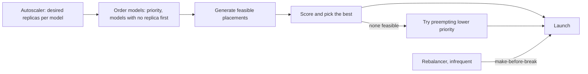
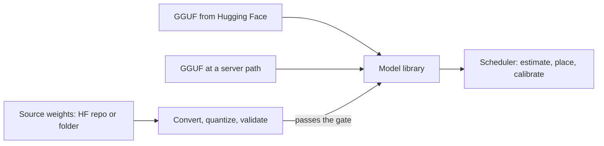

# gpupool — Multi-model, multi-server platform design (implemented)

> English version. Vietnamese version: [PLATFORM_DESIGN.vi.md](PLATFORM_DESIGN.vi.md). Keep both in sync.

**Status: implemented.** All four rollout phases (section 9) are in the code, plus three later additions: per-model VRAM
self-calibration and persisted control state (which the design called for in its open questions), and
conversion of Hugging Face models to GGUF (section 6).
This is a design-rationale document: why the system behaves as it does. For the exact HTTP interface see
[API.en.md](API.en.md).

Goal: gpupool manages **many models on many servers and GPUs** at once, shares resources deliberately
(priority, spreading, load-based scaling) and **recommends GPUs/servers** for each model with reasons
and estimates. This document covers the behaviour that motivated the design, the resource model, the
allocation algorithm, how models get into the library (conversion, which also chooses a quantization type that
fits the cluster), a summary of the API, the data changes and the rollout.

## 1. Baseline: behaviour with several models before this design

Measured with the **real** reconciler and scheduler as they were before phase 1 (fake agents, real GGUF
metadata of Qwen2.5 0.5B = 587 MB and 3B = 2191 MB at ctx 4096). Each problem below has since been
addressed by the section that follows it.

| Scenario | What happened | Problem |
| --- | --- | --- |
| 2 replicas of `chat`, server a: 2×8 GB, b: 1×8 GB | both replicas on **a/CUDA0** | no fault tolerance (one GPU dies = model gone); two replicas compete for one GPU while two GPUs idle |
| `alpha` and `zeta` (3B), one 4 GB GPU fits one | `alpha` runs, `zeta` NoFit | the winner is decided by **name order**; no way to say which model matters |
| `big` 3B + `small` 0.5B, a: 8 GB + 8 GB | both on **a/CUDA0**, CUDA1 empty | the scheduler only sees memory; two active models halve one GPU's bandwidth |
| `small` then `big`, a: 3 GB + 2.4 GB | `big` → CUDA0, `small` → CUDA1 | correct: memory best-fit works |

Root causes, from the code at that time:

- `Reconciler._enforce_counts` walked models `ORDER BY name`, one replica per model per tick. There was no
  priority and no preemption.
- `scheduler.placement.plan` was a pure function that only saw `usable_mb`. It did not know where other
  replicas run, which GPU is faster or which GPU is busy. Tier `single_gpu` picked the **smallest GPU that
  still fits** (best-fit), which naturally piles everything onto the same GPU.
- `replicas` was a fixed number. An unused model held VRAM forever, and an overloaded model never gained a
  replica.
- NoFit was all-or-nothing: it did not suggest a smaller `ctx_size`, nor say how much is missing, or where.

## 2. Resource model

A GPU has two kinds of resources, and they behave differently:

| Resource | Nature | Source | Use |
| --- | --- | --- | --- |
| VRAM | **hard**: short means it cannot load | `usable_mb`, `est_mb` estimate (`scheduler/estimate.py`), corrected per model by the calibration factor (section 4.7) | hard constraint |
| Memory bandwidth | **soft**: sharing slows it down | NVML: bus width × mem clock (measured on GTX 1650 Ti: 128 bit × 5001 MHz ≈ 160 GB/s) | tok/s estimate, performance score |
| Busyness | **soft**, changes over time | llama-server `/metrics`: `requests_processing`, `requests_deferred`, `predicted_tokens_seconds` (checked on b11342); router `outstanding` | co-location penalty, autoscale signal |

**Decode speed estimate.** Each generated token reads all weights once, so decode is bandwidth-bound:

```latex
t_{token} = \sum_{d \in \text{devices}} \frac{\text{bytes}_d}{BW_d \cdot \eta} + n_{rpc} \cdot t_{hop}
\qquad \text{tok/s} \approx 1 / t_{token}
```

`bytes_d` is the sum of `layer_bytes` of the layers placed on device d (already in `ModelMeta`; the output
tensors count on the last device). For a MoE layer only the bytes a token reads count: the shared weights
plus `expert_used_count / expert_count` of the routed experts (`ModelMeta.active_bytes`). `n_rpc` counts RPC
servers, not remote devices: the GPUs of one server that a replica uses sit behind one `ggml-rpc-server`
(agents with the `rpc_multi_device` feature), which copies activations between them locally. η is the real-world efficiency: the numbers in `TEST_REPORT` give
η ≈ 0.45 for 0.5B (182 tok/s against ~400 in theory) and ≈ 0.6 for 3B (51 tok/s against ~84). The code uses
a constant **η = 0.5** and `t_hop` = 2 ms per RPC hop (`scheduler/scoring.py`). A GPU without a known
bandwidth gets a default. Prefill depends on compute more than on bandwidth; the estimate ranks by decode
only. Measured decode speed is read from `/metrics` and shown next to the estimate in
`GET /api/models/{name}/scaling`, but it does **not** feed back into η (see open questions).

**Before the file exists.** For a model that has not been converted yet there is no GGUF header to read, so the
VRAM need is estimated from `config.json` and the quantization type (section 6.2). That estimate only guides
the choice of a type; once the GGUF exists the scheduler uses its real header and the calibration factor.

**Sharing a GPU.** Two busy models on one GPU split its bandwidth, each getting about half its speed. A
model that is mostly idle can share fine. The co-location penalty is therefore based on **measured
busyness**, not a hard ban.

## 3. Per-model policy

All fields are optional, and their defaults keep the behaviour of a plain fixed-replica model. The full
field table, with types and limits, is in [API.en.md](API.en.md#2-modelspec).

| Field | Default | Meaning |
| --- | --- | --- |
| `priority` | 50 | 0–100. Higher priority places first and, when short on room, may take the place of lower priority |
| `min_replicas` | = `replicas` | replicas always kept (0 = may be unloaded when idle) |
| `max_replicas` | = `replicas` | > `min_replicas` enables autoscaling |
| `autoscale` | `{target_busy: 0.7, up_after_s: 30, down_after_s: 300}` | thresholds for adding/removing replicas by busy-slot ratio |
| `idle_unload_s` | null | only with `min_replicas = 0`: unload after N s without requests; the first request loads it again |
| `spread` | `"gpu"` | `gpu`: replicas prefer different GPUs; `node`: different servers; `none`: don't care |
| `pin_devices` | empty | `"node_id/device_id"` entries a replica may use; empty = free choice |
| `preemptible` | true | false = never preempted |
| `kv_cache_type`, `speculative`, `draft`, `draft_n_max`, `flash_attn`, `batch`, `ubatch`, `kv_unified` | `f16`, `none`, null, 4, `auto`, 2048, 512, false | memory/speed options that the estimate and the planner take into account (added after this design); `speculative` is `none`, `ngram`, `draft` or `mtp` |

`replicas` is the on/off switch: 0 stops the model whatever `min/max` say. With `min_replicas` and
`max_replicas` unset both equal `replicas`, so a fixed-count model behaves as before.

**Decided not to build.** The first draft also proposed `share_gpu`, `gpu_selector` (labels,
`min_vram_mb`, `min_bandwidth_gbps`), server/GPU **labels** and a per-GPU `reserve_mb`. They are not in the
code. `pin_devices` covers explicit placement, and the per-device `budget_mb` on the agent (which also
subtracts the VRAM gpupool's own replicas hold) covers keeping VRAM back for other work. Labels would be
added only if a cluster appears where pinning single devices is too coarse.

## 4. Allocation algorithm



**4.1 Order.** Each tick, sort models by `priority` descending. Within a level, models with **no replica
yet** go before models that already have one (every model gets 1 replica before any gets a second), then by
**name** (a stable tie-break; the first draft said creation time). Name order only breaks ties now.

**4.2 Candidate placements.** `scheduler/placement.py` generates several feasible candidates instead of one
per tier: every single GPU that fits, multi-GPU combinations within a node, and multi-node placements (only
when needed; the greedy variants first, then subsets by bandwidth). `plan()` returns the best one with
ports allocated; `rank()` returns the top `k` without ports, which `recommend`, `simulate` and rebalancing
use. Real clusters have few GPUs (tens), so enumeration is cheap. The layer split algorithm (`_split`) is
unchanged. A speculative `draft` model is placed whole on the head's first CUDA device and counted in that
device's `est_mb`.

**4.3 Scoring.** Each candidate gets a score; higher wins. The weights are constants in
`scheduler/placement.py`, not configuration:

```latex
\text{score} = 100 \cdot \frac{tps}{tps_{best}} - \sum_{o \in \text{engines on chosen GPUs}} (10 + 30 \cdot busy_o) - 40 \cdot same_{gpu} - 20 \cdot same_{node} - 15 \cdot waste - 5 \cdot (n_{dev}-1) - 10 \cdot n_{rpc}
```

- `tps / tps_best`: estimated decode speed relative to the fastest candidate.
- Each engine already on a chosen GPU costs 10, plus 30 times its busyness (0–1).
- `same_gpu`, `same_node`: replicas of the same model already on that GPU / server (per `spread`: `gpu` and
  `node` penalise a shared GPU; only `node` penalises a shared server).
- `waste`: mean of `usable / biggest usable` over the chosen GPUs. This keeps best-fit's strength: do not
  carve up a large GPU while a snug one is free.
- `n_dev`, `n_rpc`: extra devices and network hops (one per RPC server).

Ties break by smaller tier, then the first device's name, so results are deterministic. The winning
placement is stored with the replica (`score`, `est_decode_tps`, `reasons`), so the UI can explain why a
model runs where it does.

**4.4 Preemption.** A model below its running minimum (`max(min_replicas, 1)`, bounded by the desired
count, so autoscale extras never evict) and with no feasible placement may stop lower-priority replicas:

1. Eligible victims: replicas of `preemptible` models with priority **strictly lower** than P (equal never
   preempts). Order: replicas above their model's running minimum first, then the least busy, then the
   newest.
2. Add victims one by one to a simulated "removed" set until a placement exists, then drop any victim that
   turns out to be unnecessary. The result is a small set, not necessarily the smallest possible.
3. Drain them (the existing `drain`: wait for in-flight requests, at most `drain_timeout_s`). The
   preempting model is not placed in the same tick; draining replicas still hold their memory, so a later
   tick places it. A `preempted` warning event is emitted per victim.
4. **Cooldown** of 10 minutes per preempting model, and no further eviction while its earlier victims still
   drain, so two models cannot keep evicting each other.
5. **Claim.** While a preempting model has no replica yet (at most `drain_timeout_s` + 120 s) models of
   lower priority do not launch. Without this, the evicted model relaunches straight into the memory being
   freed (a bug found on real hardware).

**4.5 Autoscaler.** Each replica has `busy = requests_processing / parallel`, read from llama-server
`/metrics` every `poll_s` (a scrape older than 3 polls is replaced by the router's outstanding count).
`requests_deferred > 0` means requests are queueing.

- Add 1 replica when average `busy` > `target_busy`, or requests queue, for `up_after_s` and no replica is
  still launching. Never above `max_replicas`.
- Remove 1 replica when `busy` < `target_busy / 2` and nothing queues for `down_after_s`. Never below the
  running floor `max(min_replicas, 1)`: going to zero is only done by `idle_unload_s`.
- `idle_unload_s`: no request for that long and nothing in flight, with `min_replicas = 0` → desired 0.
- **Cold start**: when the router gets a request for a started model with `min_replicas = 0` and no replica,
  the autoscaler sets desired to 1, emits `cold_start` and wakes the reconciler; the router holds the request
  up to `cold_start_timeout_s` (default 120 s). Past that, it returns 503 with `Retry-After`.
- **Persistence.** The desired count, last request time and last decision are written to the store
  (`control_state`, key `autoscaler:<model>`) when they change, so a restart keeps an unloaded model
  unloaded and a scaled-up model scaled up. The up/down timers are not saved: a restart only delays a step by
  `up_after_s`/`down_after_s`.

**4.6 Rebalancing.** Runs rarely (every `rebalance_s`, default 600 s, 0 = off; the first run is one period
after boot because reports are stale right after a restart) or on demand (`POST /api/rebalance`). Target:
replicas that now score at least 25 points higher somewhere else (e.g. a model on CPU or split over 2 GPUs
that now fits on 1 GPU); a move stays within the model's `pin_devices`. The method is **make-before-break**:
launch the new replica (planned on the target devices while the old one still holds its memory), wait for
ready, then drain the old one. Only one replica moves at a time cluster-wide, and only when the cluster is
quiet: no replica launching, no preemption waiting for its memory. A move whose new replica fails, or does
not become ready within `launch_timeout_s` + 60 s, is abandoned with a `rebalance_failed` warning and the old
replica keeps serving.

**4.7 VRAM self-calibration.** The memory estimate is exact to the MiB for the cases measured on a GTX 1650,
but was never measured for large models over several GPUs. Instead of trusting it, each model learns a
correction. After a replica is ready, the coordinator reads what llama.cpp reported when it loaded
(`GET /engines/{id}/memory` on the head's agent), sums the measured buffers over the placement's devices and
compares with the estimate (divided by the factor it was planned with, minus the runtime context llama.cpp does not report). The ratio is folded into a
per-model factor by exponential moving average (weight 0.5) and stored in `model_calibration`. Planning
multiplies the model's device needs by the factor, clamped to 0.9–2.0. A `calibrated` event is emitted when
the factor moves by more than 5 %; a sample with partial data is skipped rather than biasing the factor. The
factor is visible as `calibration` in `GET /api/state`.

**4.8 Persisted control state.** Besides the autoscaler's state, the reconciler writes to `control_state`
the preemption cooldowns and claims (`preempted`), crash-loop backoffs (`backoff`) and the replica move in
flight (`move`), and loads them at boot. A coordinator restart therefore does not forget a cooldown (letting
two models evict each other again), a backoff (hammering a crashing model) or half a move (leaving two
replicas of the same model). A move whose replicas no longer exist is cleared quietly. Times are wall-clock.
The last-rebalance time is deliberately not saved.

## 5. GPU/server recommendation

Answers "where should this model run?" **before** deploying, with the same scoring as the scheduler, so
what is recommended is what the scheduler would do.

- Ranks up to `limit` options, each with expected VRAM, estimated tok/s, score and reasons.
- Says whether an option fits now or needs to preempt someone (`requires_preemption`, listing the
  replicas to stop).
- Reports the largest `ctx_size` that fits one GPU now (`max_ctx_single_gpu`).
- When nothing fits, says why: the memory needed, the largest free single GPU and node, and the largest
  `ctx_size` that would fit (`not_possible`).

The same question is asked one step earlier for a model that must first be converted: which quantization type
will fit this cluster. That recommendation (section 6.2) uses the cluster's largest GPU and total VRAM instead
of the scheduler's scoring, because at that point there is no file to place yet.

## 6. Getting models in: conversion

The scheduler places GGUF files, but a lot of models are published only as safetensors or PyTorch weights.
Without a way to turn those into GGUF the platform would be limited to what someone else already converted,
and to the quantization they happened to pick. This section is the rationale; the pipeline itself (stages,
caching, disk checks, persistence) is in [DESIGN.en.md](DESIGN.en.md#17-hugging-face-to-gguf-conversion-converter),
usage in [QUICKSTART.en.md](QUICKSTART.en.md#serving-a-model-that-has-no-gguf-convert) and the routes in
[API.en.md](API.en.md#12-conversion-apiconvert).

### 6.1 Where conversion fits



There are three ways into the library. A ready GGUF is downloaded or registered as before. Source weights go
through a conversion job whose only product is a GGUF file that the library registers like any other
(`LibraryItem.source` is `"convert"`). From there the scheduler does not care how the file got there: it reads
the real GGUF header and self-calibrates VRAM (4.7) exactly as for a downloaded model. That is the point of
making conversion produce an ordinary library item rather than a special kind of model.

**Why in the coordinator.** The coordinator owns the library (`models_dir`), so the output lands where it will
be used and no file has to be shipped between machines. Conversion and quantization are CPU, RAM and disk work
and need no GPU, so the CPU toolchain (llama.cpp's converter, `llama-quantize`, `llama-imatrix`) is enough, and
the GPUs stay free for inference. The cost is that the coordinator also serves the router, so the work is
shaped to stay out of its way: **one job at a time**, in submission order, with every tool at low priority.
Two jobs at once would only slow each other down and could exhaust the disk; one job at low priority slows the
coordinator a little but does not starve routing. The toolchain is optional, so a coordinator without it keeps
working and only refuses conversion requests with an explanation.

### 6.2 Choosing the quant type against cluster capacity

The quantization type decides the file size, so it decides whether the model fits one GPU, needs several
(split over RPC, which is slower), or does not fit at all. Making the user pick a type blind would mean
converting, finding out it does not fit and converting again, which costs minutes to hours of CPU. So
`inspect` looks at the source **before** any work and tells the user, per type, the estimated size and whether
it fits the cluster as it is now.

- **Size estimate.** Each type has a whole-model bits-per-weight taken from `llama-quantize`'s published
  Llama-3-8B sizes. Applied directly it was 24 % low on Qwen2.5-0.5B, because two effects depend on the
  model. The token embedding and output matrices stay near 8 bits in low-bit types; they are about 13 % of
  Llama-3-8B but 28 % of a small model with a large vocabulary, so they are costed separately (about 8.5 bpw)
  and the bpw of the remaining weights is derived from the reference. And K-quants need rows that are a
  multiple of 256 values; when the hidden size is not (Qwen2.5-0.5B: 896), `llama-quantize` falls back per
  tensor to a legacy type, which is larger, so the estimate uses the bpw of the fallback. Measured: Qwen2.5-0.5B
  `Q4_K_M` 390.7 MB estimated against 397.8 MB real, SmolLM2-135M 103.1 against 105.5 MB. The same estimate
  guards the disk (DESIGN section 17.3), including a check at submit that refuses a job the disk obviously
  cannot hold.
- **IQ types.** Their nominal bits per weight understate real files, because `llama-quantize` keeps the
  output matrix and the most sensitive tensors at higher types, so their rows use whole-file sizes published for
  Llama-3-8B rather than the nominal figure (the nominal one is quoted in the note). They fall back to a 4.5 bpw
  type for rows not divisible by 256, like the K-quants.
- **VRAM.** File size + f16 KV cache at context 4096 + 300 MB of runtime overhead. It is a fixed,
  deliberately plain assumption for the decision, not a promise about the final `ctx_size`.
- **Fit.** Each type is marked as fitting the **largest GPU** and as fitting the **pool** (the sum of all
  GPUs). The difference matters: a model that fits only the pool must be split over RPC, which is slower, so
  fitting one GPU is preferred and the reason says so when the pool is used.
- **Recommendation ladder.** The first type that fits one GPU from `Q8_0`, `Q6_K`, `Q5_K_M`, `Q4_K_M`
  (best quality first); if none, the first that fits the pool. Models under 3 B parameters only use the first
  three, because small models lose quality fastest; if even those do not fit, the full ladder is tried and the
  reason says quality will suffer. Lower types (Q3, Q2, IQ) are listed as options but are not on the ladder:
  choosing one is a conscious trade of quality for memory. With no GPU servers there is no fit information,
  and a size rule applies instead (`Q8_0` below 3 B, `Q5_K_M` below 15 B, else `Q4_K_M`).

**Relation to the scheduler.** The conversion estimate only guides the choice of a type. Once the job is done
the file is an ordinary library item, and placement uses its real header (`ModelMeta`) and the per-model
calibration factor (4.7). The two estimates do not need to agree exactly, and the real one always wins.

### 6.3 Importance matrices

Quantization rounds weights, and rounding every weight equally wastes bits on weights that hardly matter. An
**importance matrix** (imatrix) records, for each weight, how strongly it is exercised when the model processes
real text, so `llama-quantize` can spend its error budget where it hurts least. The gain grows as the type gets
smaller; at about 4 bits and above the loss is already small and the extra work is not worth doing by default.

`imatrix` is `auto`, `on` or `off`:

- `auto` turns it on when the type needs one, or its bits per weight is below 4 (`Q3_K_S`, `IQ3_*`, `Q2_K`,
  `IQ2_*`, `IQ1_*`).
- Some types **require** one: `IQ1_S`, `IQ1_M`, `IQ2_XXS`, `IQ2_XS`, `IQ2_S`, `IQ2_M`, `IQ3_XXS`, `IQ3_XS`
  (`llama-quantize` refuses tensors of these types without a matrix; `IQ2_M` and `IQ3_XS` files contain such
  tensors). Setting `off` for them is refused at submit with 422 instead of failing after hours of conversion.
- `on` computes one for any quantized type (slower, better at every size). `F16`, `BF16` and `Q8_0` are written
  by the converter directly, with no `llama-quantize` step to feed a matrix into, so they never compute one.
- The decision is made at submit and stored as `imatrix_used`, so it is visible before the job runs.

**Cost.** One extra pass: `llama-imatrix` runs the 16-bit model on the CPU over N chunks of 512 tokens (default
100, `imatrix_chunks`) and writes the matrix; it is a job state of its own, `calibrating`, between `converting`
and `quantizing`. That is a forward pass of the unquantized model, so it is the slowest part for large models
and is the reason `auto` is not simply "always". `llama-imatrix` is optional like the rest of the toolchain
(`imatrix_available` in `GET /api/convert/options`); without it, work that needs a matrix is refused with a
clear 503, and other conversions still work.

**Calibration text.** The matrix reflects the text it was computed on, so the text is a design decision. gpupool
ships its **own, original** multilingual text (prose, Vietnamese, CJK, code, math, JSON, chat-formatted
dialogue). Original, because the usual public calibration sets carry licenses that gpupool cannot simply
redistribute; multilingual and with code, because a matrix computed on English prose protects English at the
expense of other languages and code (the bias of the matrix is the bias of its text), and this platform is not
English-only. A user who knows the model's domain can pass `calibration_path` (an absolute `.txt` on the server,
host paths translated like library paths, at most 20 MB).

### 6.4 Validation as a gate into the library

A converted model is not trusted blindly: the converter has per-architecture code, tokenizers are converted
separately from weights, and a wrong tokenizer degrades answers silently, with nothing crashing to warn
anyone. So a result is published to the library only after `validating`:

- the GGUF header must be readable, with an architecture and a tokenizer (else the job **fails**; the file
  could not be served);
- the tokenizer is compared with the Hugging Face one on fixed probe texts, including Vietnamese, CJK and an
  emoji sequence, the places where converted tokenizers usually differ;
- a short generation is run on the CPU as a smoke test.

A failed comparison or smoke test makes the job `needs_review`: the file is kept but **not** in the library,
and a person decides to accept or delete it, because it may be a converter bug or an acceptable quirk and only
a person can tell. A check that could not run (no RAM, timeout) is only a warning, since blocking on it would
make small coordinators unusable. The details are in DESIGN section 17.4.

### 6.5 Safety boundaries

- **No repository code by default.** The converter loads tokenizers with `trust_remote_code=True`, which would
  run a repository's `*.py` inside the coordinator. Those files are not downloaded or staged unless the request
  sets `allow_remote_code`, which the UI marks as dangerous.
- **Offline converter.** It runs with the Hugging Face hub in offline mode and sees only a **staging folder of
  links** to the selected files, so a source folder is never modified and never read beyond what was chosen.
- **Narrow deletion.** Only paths inside `models_dir/.convert` and `models_dir/.hf` are ever removed.
- **Checked inputs.** Output names and user-supplied quantization flags are validated (names, a whitelist of
  ggml type names), so a value can never become an extra command-line argument.

## 7. API summary

The full reference, with request and response shapes, is [API.en.md](API.en.md). All design endpoints live
under `/api` and take the admin key; new request fields are optional, so older clients keep working.

| Capability | Endpoints |
| --- | --- |
| Model policy (sections 3, 4.5) | `PUT /api/models/{name}`, `POST .../start`, `POST .../stop`, `DELETE /api/models/{name}`, `GET .../scaling`, `POST .../plan` |
| Capacity and recommendation (section 5) | `GET /api/capacity`, `POST /api/recommend` |
| Simulation (section 4.4) | `POST /api/simulate`: starts, stops and preemptions the reconciler would do under hypothetical changes |
| Rebalancing (section 4.6) | `POST /api/rebalance` (`dry_run` defaults to true) |
| State and events | `GET /api/state` (includes `calibration`, `rebalance`), `GET /api/events`, `POST /api/events/read` |
| Router | `/v1/*` cold start returns 503 + `Retry-After` past `cold_start_timeout_s` |
| Conversion (section 6) | `GET /api/convert/options`, `POST /api/convert/inspect`, `POST /api/convert`, `GET /api/convert[/{job_id}]`, `POST .../cancel`, `.../retry`, `.../accept`, `DELETE /api/convert/{job_id}` |

Events added by the design: `preempted` (warning), `scaled_up`, `scaled_down`, `unloaded_idle`,
`cold_start`, `rebalance_started`, `rebalanced`, `calibrated` (info), `rebalance_failed` (warning).

Differences from the first draft: there are no label endpoints (`PUT /api/servers/{id}/labels`) and
`PUT .../gpus/{device_id}` only takes `enabled`; `POST /api/simulate` reports `start`, `stop`, `preempt` and
`unplaced` but no `move` (rebalance moves are previewed with `POST /api/rebalance`); `not_possible` carries
`need_mb`, `largest_single_gpu_mb`, `largest_single_node_mb` and `max_ctx_that_fits`.

## 8. Data changes

- `ModelSpec`: the policy fields (JSON in the `models` table, no migration), later also `kv_cache_type`,
  `speculative`, `draft`, `draft_n_max`, `flash_attn`, `batch`, `ubatch`, `kv_unified`.
- `NodeReport.features`: capabilities an agent has beyond 0.5 (`rpc_multi_device`); the coordinator only uses
  what an agent reports, so it can be upgraded before its agents.
- `ModelMeta`: per-layer cache layout (`kv_k`, `kv_v`, `swa`, `n_swa`, `state_bytes`), MTP blocks (`n_nextn`,
  `nextn_bytes`) and MoE `active_bytes`, all optional (metadata without them keeps the old estimate).
- `Device`: `bandwidth_gbps` (the agent reads it from NVML), `uuid`, `budget_mb`. Old agents omit them, and
  their GPUs count as equal.
- `Placement`: `score`, `est_decode_tps`, `reasons`, `draft_est_mb`.
- `gpu_flags` is keyed by the card's uuid when reported. There is no `server_labels` table and no
  `labels`/`reserve_mb` column (see section 3).
- Table `control_state(key, value, updated_at)`: autoscaler state per model, `preempted`, `backoff`, `move`.
- Table `model_calibration(model, factor, samples, updated_at)`; cleared once when the estimator version changes
  (`control_state` key `estimator`).
- Table `convert_jobs`: conversion jobs and their state; a finished job's file is an ordinary library item
  with `source` `"convert"` (section 6).
- The last request time per model lives in the autoscaler (persisted at a slow cadence); the router only
  reports requests to it.

## 9. Rollout

| Phase | Content | Risk | Status |
| --- | --- | --- | --- |
| 1. Foundation | `priority` and fair ordering; `spread`; busy-GPU co-location penalty; `bandwidth_gbps` + tok/s estimate; candidate generation + scoring; `GET /api/capacity`; `POST /api/recommend`; recommendation panel in the "New model" form | low: never removes a running replica | done |
| 2. Scaling | read llama-server `/metrics`; `min/max_replicas` + autoscaler; `idle_unload_s` + router cold start; `GET /scaling` | medium: replicas added/removed automatically | done |
| 3. Preemption | preemption + cooldown + claim; `POST /api/simulate` | medium: removes serving replicas, draining must be right | done |
| 4. Rebalancing | make-before-break rebalance; `POST /api/rebalance` | highest: reloading large models takes time | done |
| After 4 | VRAM self-calibration (4.7); persisted control state (4.8) | low | done |
| Engine pass | one `ggml-rpc-server` per server and replica; `mtp` speculative decoding; `kv_unified`; per-layer KV estimate (SWA, MLA, hybrid, MTP) and MoE decode speed; RDMA transport in the agent image | medium: changes what runs on every split replica | done, not yet run on real multi-GPU hardware |
| Conversion | Hugging Face / folder to GGUF in the coordinator; quantization type chosen against cluster capacity; importance matrices; validation gate (section 6) | medium: CPU, RAM and disk heavy, runs beside the router | done |

**Phase 1 status:** done. Real run on a GTX 1650: a `priority` 80 model wins over one whose name sorts first; replicas and new models spread to other GPUs (simulated with the real scheduler); estimated vs measured decode 41.6 vs 51.8 tok/s (3B) and 204 vs 182 (0.5B). `budget_mb` now also subtracts the VRAM gpupool's own replicas hold. Spreading has not been checked on real multi-GPU hardware.

**Phase 2 status:** done. Real run on a GTX 1650: an on-demand 3B model unloaded after 20 s without requests, and the next request cold-started it and got its answer after 2.9 s; a 0.5B model (min 1, max 2) went to 2 replicas about 9 s after requests started queueing, 82 requests split 49/33 between them, and it went back to 1 after 16 s without load. When this was measured, autoscaling state was in memory only and a coordinator restart sent every model back to its running minimum; it is now persisted (4.5, 4.8).

**Phase 3 status:** done. Real run on a GTX 1650 (budget 2500 MB): `/api/simulate` predicted exactly that `q05` (priority 20) would be stopped to run `q3b` (priority 80), `/api/recommend` returned a `fits_now: false` option naming the replica to stop, and with `q05` non-preemptible it reported `q3b` as unplaceable. Real preemption: `q3b` ran 23.5 s after start, and `q05` could not evict it back. The first run exposed a bug: the evicted replica turns draining, so its model relaunched straight into the memory being freed. Fixed with a claim: while the preempting model has no replica yet (at most `drain_timeout_s` + 120 s), lower priorities do not launch.

**Phase 4 status:** done. Real run with two agents on one machine (a: GPU capped at 1000 MB, b: CPU only): replica `y` running on b/CPU (~30 tok/s estimated) was moved to a/CUDA0 (~204 tok/s) once the GPU freed up, score +100, in about 9.5 s. During the move a client sent 23 requests back to back and none failed. Afterwards a new check proposed nothing. The periodic run follows `rebalance_s` (default 600 s, 0 = off).

**Conversion status:** done. The size estimate was checked against real files on two models (6.2: within about 2 %). The tokenizer comparison and the generation smoke test run against the real toolchain. Importance matrices and the IQ types were added after that first run; their size estimates and the quality gain they give have not been measured here. The pipeline has not been run on a model large enough to stress the coordinator's RAM and disk.

Each phase is checked on a real cluster, with at least 2 servers and 2 models, before the next one starts.

## 10. Open questions and decisions

Decided:

- **VRAM estimate accuracy for large models over several GPUs.** Not measured by hand; instead every model
  calibrates itself from what llama.cpp really allocated (4.7). The estimate stays the starting point, the
  measured factor corrects it per model.
- **Labels, `share_gpu`, `gpu_selector`, `reserve_mb`.** Not built (section 3).
- **Restart behaviour.** Control state is persisted (4.8); only the rebalance timer restarts on purpose.

Still open:

- **η per GPU architecture.** The only numbers come from one GTX 1650 and the code uses a fixed η = 0.5. The
  measured decode speed is collected, so per-model η self-calibration is possible, but it is not
  implemented. Datacenter GPUs may differ a lot, so it should be done before relying on tok/s ranking there.
- **Calibration on large models.** The mechanism exists, but a real ≥ 7B model over several GPUs has not been
  run through it yet; the clamp 0.9–2.0 and weight 0.5 are untuned.
- **Prefill** is compute-bound (SMs × clock), not bandwidth-bound. Models that mostly take long prompts may
  need a separate performance score.
- **Scoring weights** in 4.3 are a starting point, constants in code, to be tuned against real
  measurements.
- **Importance matrices on GPU servers.** The matrix is computed on the coordinator's CPU, which is slow for
  large models while GPUs elsewhere in the cluster sit idle. Running `llama-imatrix` on an agent that has a
  GPU would be much faster, at the cost of shipping the 16-bit model to it and a second kind of job to track.
- **Distributing conversion.** One job at a time on one machine is simple and safe, but a queue of large
  models waits. Spreading jobs over several machines needs shared storage or file transfer, and a way to keep
  the disk checks honest.
- **LoRA adapters.** Merging an adapter into a base model before quantizing, or serving it separately, is not
  supported; only full weights convert.
- **Vision projectors (`mmproj`).** Multimodal models need a second GGUF for the vision part. Only the text
  model is converted, so such a model serves text only.
- **Calibration per model family.** One built-in multilingual text serves every model. Choosing or generating
  text per family, or per intended use (code, chat, a language), could give a better matrix, and nothing
  measures yet whether it would be worth the complexity.
- **Spreading and rebalancing on real multi-GPU, multi-server hardware** are verified only with simulated
  agents and a single-GPU machine.
- **The engine pass on real hardware.** One RPC server per server, `draft-mtp`, `kv_unified`, the per-layer KV
  layout and RDMA follow the llama.cpp b11342 source and are unit-tested, but have not been measured on a real
  split model. Expected: fewer RPC round trips per token for two GPUs on one server; smaller, closer estimates
  for SWA / MLA / hybrid models (calibration then corrects the rest).
- **Hop cost.** `t_hop` = 2 ms per RPC server is a guess from one machine; with RDMA or on a fast LAN it is far
  smaller and should be measured (or calibrated from the measured decode speed) before it ranks placements.
