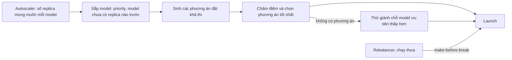

# gpupool — Thiết kế platform đa model, đa server (bản nháp)

> Bản tiếng Việt. Bản tiếng Anh: [PLATFORM_DESIGN.en.md](PLATFORM_DESIGN.en.md). Giữ hai bản đồng bộ.

Mục tiêu: gpupool quản lý **nhiều model trên nhiều server, nhiều GPU** cùng lúc, chia tài nguyên có
chủ đích (ưu tiên, dàn trải, tự co giãn theo tải) và **gợi ý GPU/server** cho từng model kèm lý do và số
ước lượng. Tài liệu này mô tả hiện trạng đo được, mô hình tài nguyên, thuật toán phân bổ, API và lộ
trình triển khai theo giai đoạn.

## 1. Hiện trạng: điều gì xảy ra khi chạy nhiều model

Chạy reconciler và scheduler **thật** (agent giả, metadata GGUF thật của Qwen2.5 0.5B = 587 MB và
3B = 2191 MB ở ctx 4096):

| Tình huống | Kết quả hiện tại | Vấn đề |
| --- | --- | --- |
| 2 replica của `chat`, server a: 2×8 GB, b: 1×8 GB | cả 2 replica nằm trên **a/CUDA0** | không chịu lỗi (1 GPU chết = mất cả model), 2 replica tranh nhau một GPU trong khi 2 GPU rảnh |
| `alpha` và `zeta` (3B), một GPU 4 GB chỉ đủ 1 model | `alpha` chạy, `zeta` NoFit | thắng thua theo **thứ tự tên**; không có cách khai báo model nào quan trọng hơn |
| `big` 3B + `small` 0.5B, a: 8 GB + 8 GB | cả hai trên **a/CUDA0**, CUDA1 bỏ trống | scheduler chỉ nhìn bộ nhớ; hai model cùng chạy sẽ chia đôi băng thông của một GPU |
| `small` rồi `big`, a: 3 GB + 2.4 GB | `big` → CUDA0, `small` → CUDA1 | đúng: best-fit theo bộ nhớ hoạt động tốt |

Nguyên nhân gốc, đọc từ code:

- `Reconciler._enforce_counts` duyệt model theo `ORDER BY name`, mỗi tick một replica mỗi model. Không có
  khái niệm ưu tiên, không có giành chỗ (preemption).
- `scheduler.placement.plan` là hàm thuần chỉ thấy `usable_mb`. Nó không biết replica nào khác đang chạy
  ở đâu, không biết GPU nào nhanh hơn, không biết GPU nào đang bận. Tier `single_gpu` chọn GPU **nhỏ
  nhất còn vừa** (best-fit), nên tự nhiên dồn mọi thứ vào cùng một GPU.
- `replicas` là số cố định. Model không ai dùng vẫn giữ VRAM mãi, model quá tải không tự thêm replica.
- NoFit là tất cả hoặc không có gì: không gợi ý giảm `ctx_size`, không nói thiếu bao nhiêu, ở đâu.

## 2. Mô hình tài nguyên

Một GPU có hai loại tài nguyên, và chúng cư xử khác nhau:

| Tài nguyên | Tính chất | Nguồn số liệu | Cách dùng |
| --- | --- | --- | --- |
| VRAM | **cứng**: thiếu là không load được | `usable_mb` (đã có), ước lượng `est_mb` (đã có) | ràng buộc bắt buộc |
| Băng thông bộ nhớ | **mềm**: chia sẻ thì chậm đi | NVML: bus width × mem clock (đo trên GTX 1650 Ti: 128 bit × 5001 MHz ≈ 160 GB/s) | ước lượng tok/s, điểm hiệu năng |
| Mức bận | **mềm**, thay đổi theo thời gian | llama-server `/metrics`: `requests_processing`, `requests_deferred`, `predicted_tokens_seconds` (đã kiểm trên b11342); router `outstanding` | phạt khi ghép chung GPU, tín hiệu autoscale |

**Ước lượng tốc độ decode.** Sinh mỗi token phải đọc toàn bộ trọng số một lần, nên decode bị giới hạn bởi
băng thông:

```latex
t_{token} = \sum_{d \in \text{devices}} \frac{\text{bytes}_d}{BW_d \cdot \eta} + n_{rpc} \cdot t_{hop}
\qquad \text{tok/s} \approx 1 / t_{token}
```

`bytes_d` là tổng `layer_bytes` của các layer đặt trên thiết bị d (đã có trong `ModelMeta`). η là hiệu
suất thực tế: số đo trong `TEST_REPORT` cho η ≈ 0.45 với 0.5B (182 tok/s trên lý thuyết ~400) và ≈ 0.6
với 3B (51 tok/s trên lý thuyết ~84). Khởi đầu η = 0.5, sau đó **tự hiệu chỉnh** theo
`predicted_tokens_seconds` đo được của từng model (trung bình trượt). Prefill phụ thuộc compute hơn băng
thông; giai đoạn đầu chỉ dùng decode để xếp hạng.

**Ghép chung GPU.** Hai model cùng bận trên một GPU chia nhau băng thông, mỗi model còn khoảng một nửa
tốc độ. Hai model mà một bên hầu như rảnh thì ghép được. Vì vậy hình phạt ghép chung dựa trên **mức bận
đo được**, không cấm cứng (trừ khi model khai báo `share_gpu: false`).

## 3. Chính sách cho từng model

Mọi trường đều tùy chọn và có giá trị mặc định giữ nguyên hành vi hiện tại:

| Trường | Mặc định | Ý nghĩa |
| --- | --- | --- |
| `priority` | 50 | 0–100. Model ưu tiên cao được xếp trước, và khi thiếu chỗ có thể giành chỗ của model ưu tiên thấp hơn |
| `min_replicas` | = `replicas` | số replica luôn giữ (0 = cho phép dỡ khi rảnh) |
| `max_replicas` | = `replicas` | > `min_replicas` thì bật autoscale |
| `autoscale` | `{target_busy: 0.7, up_after_s: 30, down_after_s: 300}` | ngưỡng thêm/bớt replica theo tỷ lệ slot bận |
| `idle_unload_s` | null | chỉ khi `min_replicas = 0`: không có request trong N giây thì dỡ model; request đầu tiên sẽ load lại |
| `spread` | `"gpu"` | `gpu`: các replica ưu tiên khác GPU; `node`: khác server; `none`: không quan tâm |
| `share_gpu` | true | false = GPU của model này không chạy engine nào khác |
| `gpu_selector` | null | `{labels: {...}, min_vram_mb, min_bandwidth_gbps}` để giới hạn nơi được đặt |
| `preemptible` | true | false = không bao giờ bị giành chỗ |

`replicas` giữ nguyên ý nghĩa cũ (bằng `min_replicas = max_replicas = replicas`), nên CLI và UI hiện tại
không phải sửa.

Server và GPU có thêm **nhãn** (`zone=hn`, `class=a100`) và `reserve_mb` (giữ lại VRAM cho việc khác)
để người vận hành điều khiển việc đặt model mà không phải pin từng thiết bị.

## 4. Thuật toán phân bổ



**4.1 Thứ tự.** Mỗi tick, sắp model theo `priority` giảm dần. Trong cùng mức, model **chưa có replica
nào** đi trước model đã có (để mọi model có ít nhất 1 replica rồi mới tới replica thứ hai), sau đó theo
thời gian tạo. Thứ tự tên không còn quyết định gì.

**4.2 Sinh phương án.** Thay vì `plan()` trả một phương án duy nhất cho mỗi tier, có thêm
`plan_candidates(meta, spec, nodes, k)` trả nhiều phương án khả thi: mỗi GPU đơn đủ chỗ, các tổ hợp
nhiều GPU trong một node (như hiện tại, mỗi node một phương án), và phương án multi-node. Số GPU trong một
cụm thực tế nhỏ (vài chục), nên liệt kê được. Thuật toán chia layer (`_split`) giữ nguyên.

**4.3 Chấm điểm.** Mỗi phương án có điểm, các trọng số cấu hình được:

```latex
\text{score} = 100 \cdot \frac{tps}{tps_{best}} - 30 \cdot busy_{shared} - 40 \cdot same_{gpu} - 20 \cdot same_{node} - 15 \cdot waste - 10 \cdot n_{rpc}
```

- `tps / tps_best`: tốc độ decode ước lượng so với phương án nhanh nhất.
- `busy_shared`: tổng mức bận (0–1) của các engine khác trên các GPU được chọn.
- `same_gpu`, `same_node`: số replica cùng model đã có trên GPU / server đó (theo `spread`).
- `waste`: phần VRAM còn lại trên GPU được chọn mà không model nào khác có thể dùng. Đây là cách giữ lại
  ưu điểm của best-fit: không xé nhỏ một GPU lớn khi GPU vừa khít còn trống.
- `n_rpc`: số lần nhảy qua mạng.

Phương án thắng được lưu cùng replica (`placement.reasons`), để UI giải thích được vì sao model nằm ở đó.

**4.4 Giành chỗ (preemption).** Khi model có `priority` P chưa đạt `min_replicas` và không có phương án
khả thi:

1. Tập ứng viên bị giành: replica của model có priority < P, `preemptible`. Ưu tiên lấy replica vượt quá
   `min_replicas` trước, sau đó mới tới replica dưới min. Trong mỗi nhóm, lấy cái ít bận nhất.
2. Thêm dần ứng viên vào tập giả lập "đã gỡ" cho tới khi `plan_candidates` có phương án. Chọn tập nhỏ
   nhất tìm được.
3. Drain các replica đó (cơ chế `drain` hiện có: chờ request đang chạy, tối đa `drain_timeout_s`), rồi
   launch. Phát event `preempted` cho từng replica bị gỡ.
4. Cooldown theo model (ví dụ 10 phút) để hai model không giành qua giành lại.

**4.5 Autoscaler.** Mỗi replica có `busy = requests_processing / parallel`. Ngoài ra, có
`requests_deferred > 0` nghĩa là request đang phải xếp hàng.

- Tăng 1 replica khi trung bình `busy` > `target_busy` liên tục `up_after_s`, hoặc khi có request phải
  xếp hàng liên tục. Không vượt `max_replicas`.
- Giảm 1 replica khi `busy` < `target_busy / 2` liên tục `down_after_s`. Không xuống dưới `min_replicas`.
- `idle_unload_s`: không có request trong khoảng đó thì về 0 replica.
- **Khởi động lạnh**: router nhận request cho model đang có 0 replica thì gọi `reconciler.wake()`. Router
  giữ request tối đa `cold_start_timeout_s` (mặc định 120 s) trong lúc model load. Quá hạn thì trả 503 kèm
  `Retry-After`.

**4.6 Cân bằng lại (rebalance).** Chạy thưa (ví dụ mỗi 10 phút) hoặc khi người vận hành gọi. Mục tiêu:
replica có phương án mới tốt hơn rõ rệt (điểm cao hơn ≥ 25, ví dụ một model đang chia 2 GPU nay vừa 1
GPU). Cách làm là **make-before-break**: launch replica mới, chờ ready, rồi drain replica cũ. Mỗi lần
chỉ di chuyển một replica trong cả cụm, vì load lại một model lớn tốn vài phút.

## 5. Gợi ý GPU/server

Trả lời câu hỏi "model này nên chạy ở đâu?" **trước khi** deploy, với cùng bộ chấm điểm như scheduler,
nên điều được gợi ý cũng là điều scheduler sẽ làm.

- Xếp hạng tối đa `k` phương án, mỗi phương án có VRAM dự kiến, tok/s ước lượng, điểm và lý do.
- Có đặt được ngay không, hay cần giành chỗ của ai.
- Không đặt được thì nói rõ vì sao. Ví dụ: "thiếu 1.1 GB trên một node", "`ctx_size` tối đa vừa được là
  2048", "vừa nếu gỡ replica `chat-a1` (priority 20)".

## 6. API

Mọi endpoint dưới `/api`, xác thực bằng admin key như hiện tại. Các trường mới đều tùy chọn, nên client
cũ không bị ảnh hưởng.

### 6.1 Model

| Method | Path | Thay đổi |
| --- | --- | --- |
| PUT | `/api/models/{name}` | body thêm các trường chính sách ở mục 3 |
| GET | `/api/models/{name}/scaling` | mới: trạng thái autoscale (busy, replica mong muốn, quyết định gần nhất, lý do) |
| POST | `/api/models/{name}/start` | giữ nguyên; `replicas` đặt min = max |

```json
PUT /api/models/qwen-7b
{
  "file": "qwen2.5-7b-instruct-q4_k_m.gguf",
  "ctx_size": 8192, "parallel": 4,
  "priority": 80,
  "min_replicas": 1, "max_replicas": 3,
  "autoscale": {"target_busy": 0.7, "up_after_s": 30, "down_after_s": 300},
  "spread": "node",
  "gpu_selector": {"labels": {"class": "a100"}, "min_bandwidth_gbps": 500}
}
```

### 6.2 Dung lượng cụm

`GET /api/capacity`: từng GPU có gì, còn bao nhiêu, nhanh cỡ nào.

```json
{
  "gpus": [{
    "node_id": "a", "device_id": "CUDA0", "uuid": "GPU-ad15...", "labels": {"class": "t4"},
    "total_mb": 16384, "usable_mb": 9800, "reserved_mb": 4300, "free_for_new_mb": 5500,
    "bandwidth_gbps": 320, "busy": 0.42,
    "replicas": [{"replica_id": "chat-a1", "model": "chat", "est_mb": 4300, "busy": 0.42}]
  }],
  "summary": {"gpus": 6, "free_for_new_mb": 31200, "largest_single_gpu_mb": 9800,
              "largest_single_node_mb": 18100}
}
```

`largest_single_gpu_mb` và `largest_single_node_mb` trả lời nhanh câu hỏi "model X có vừa không, vừa
kiểu gì" mà không cần cộng tay.

### 6.3 Gợi ý

`POST /api/recommend`: không thay đổi gì trên cụm.

```json
// request
{"file": "qwen2.5-7b-instruct-q4_k_m.gguf", "ctx_size": 8192, "parallel": 4,
 "priority": 80, "spread": "node", "limit": 3}

// response
{
  "need_mb": 6120,
  "options": [
    {"rank": 1, "score": 91, "tier": "single_gpu", "fits_now": true,
     "assignments": [{"node_id": "b", "device_id": "CUDA1", "layers": 28, "est_mb": 6120}],
     "est_decode_tps": 41, "reasons": ["GPU nhanh nhất còn đủ chỗ (900 GB/s)", "không chung GPU với model nào đang bận"]},
    {"rank": 2, "score": 64, "tier": "single_node", "fits_now": true,
     "assignments": [{"node_id": "a", "device_id": "CUDA0", "layers": 15, "est_mb": 3400},
                     {"node_id": "a", "device_id": "CUDA1", "layers": 13, "est_mb": 2900}],
     "est_decode_tps": 27, "reasons": ["chung GPU với 'chat' (bận 42%)"]},
    {"rank": 3, "score": 58, "tier": "single_gpu", "fits_now": false,
     "requires_preemption": [{"replica_id": "embed-c2", "model": "embed", "priority": 20}],
     "assignments": [{"node_id": "c", "device_id": "CUDA0", "layers": 28, "est_mb": 6120}],
     "est_decode_tps": 38}
  ],
  "max_ctx_single_gpu": 16384,
  "not_possible": null
}
```

Khi không có phương án nào, `options` rỗng và `not_possible` giải thích, ví dụ
`{"short_mb_single_node": 1100, "max_ctx_that_fits": 2048}`.

### 6.4 Giả lập thay đổi

`POST /api/simulate`: chạy thuật toán ở mục 4 trên toàn bộ cụm với các thay đổi giả định, rồi trả về
những gì sẽ xảy ra: replica nào khởi động, replica nào bị giành chỗ, replica nào di chuyển. Không thay đổi
gì trên cụm.

```json
{"changes": [{"model": "qwen-7b", "min_replicas": 2}, {"model": "chat", "priority": 10}]}
→ {"start": [...], "preempt": [...], "move": [], "unplaced": [{"model": "qwen-7b", "missing": 1, "why": "..."}]}
```

### 6.5 Server và GPU

| Method | Path | Body |
| --- | --- | --- |
| PUT | `/api/servers/{node_id}/labels` | `{"zone": "hn", "class": "t4"}` |
| PUT | `/api/servers/{node_id}/gpus/{device_id}` | `{enabled, labels?, reserve_mb?}`, mở rộng route hiện có, lưu theo uuid như cờ bật/tắt |
| POST | `/api/rebalance` | `{"dry_run": true}`: xem trước hoặc chạy cân bằng lại |

### 6.6 Router và event

- `/v1/*`: model có `min_replicas = 0` mà đang không có replica thì khởi động lạnh (mục 4.5). Quá
  `cold_start_timeout_s` thì trả 503 kèm `Retry-After`.
- Event mới: `preempted`, `scaled_up`, `scaled_down`, `unloaded_idle`, `cold_start`, `rebalanced`. Mức
  `warning` cho `preempted`; các event còn lại ở mức `info`.

## 7. Thay đổi dữ liệu

- `ModelSpec`: thêm các trường chính sách (JSON trong bảng `models`, không cần migration).
- `Device`: thêm `bandwidth_gbps` (agent đọc từ NVML). Agent cũ không gửi thì coi như bằng nhau.
- `Placement`: thêm `score`, `reasons`.
- Bảng mới `server_labels(node_id, key, value)`. Cột `labels`, `reserve_mb` cho `gpu_flags`.
- Router lưu theo từng model: thời điểm có request gần nhất, và số request đang chờ khởi động lạnh.

## 8. Lộ trình

| Giai đoạn | Nội dung | Rủi ro |
| --- | --- | --- |
| 1. Nền tảng | `priority` và thứ tự công bằng; `spread`; phạt ghép chung GPU bận; `bandwidth_gbps` + ước lượng tok/s; `plan_candidates` + chấm điểm; `GET /api/capacity`; `POST /api/recommend`; panel gợi ý trong form "New model" | thấp: không gỡ replica nào đang chạy |
| 2. Co giãn | đọc `/metrics` của llama-server; `min/max_replicas` + autoscaler; `idle_unload_s` + khởi động lạnh ở router; `GET /scaling` | trung bình: thêm/bớt replica tự động |
| 3. Giành chỗ | preemption + cooldown; `POST /api/simulate` | trung bình: gỡ replica đang phục vụ, cần drain đúng |
| 4. Cân bằng lại | rebalance make-before-break; `POST /api/rebalance` | cao nhất: load lại model lớn tốn thời gian |

**Trạng thái:** giai đoạn 1 đã triển khai. Chạy thật trên GTX 1650: model `priority` 80 thắng model có tên đứng trước; replica và model mới dàn sang GPU khác (mô phỏng với scheduler thật); tok/s ước lượng 41.6 so với đo thật 51.8 (model 3B) và 204 so với 182 (0.5B). `budget_mb` giờ trừ cả VRAM do chính các replica của gpupool đang giữ. Chưa có cụm thật nhiều GPU để kiểm phần dàn replica trên phần cứng.

**Trạng thái giai đoạn 2:** đã triển khai. Chạy thật trên GTX 1650: model 3B ở chế độ theo yêu cầu tự dỡ sau 20 s không có request, request tiếp theo khởi động lạnh và nhận trả lời sau 2.9 s; model 0.5B (min 1, max 2) có request xếp hàng thì lên 2 replica sau khoảng 9 s, 82 request chia 49/33 cho hai replica, hết tải 16 s thì về 1. Trạng thái autoscale nằm trong bộ nhớ: coordinator khởi động lại thì mọi model quay về mức tối thiểu đang chạy.

Mỗi giai đoạn được kiểm trên cụm thật, ít nhất 2 server và 2 model, trước khi sang giai đoạn sau.

## 9. Câu hỏi mở

- **Độ chính xác của ước lượng VRAM** với model ≥ 7B và nhiều GPU (mục H3 của báo cáo review) chưa được
  đo. Gợi ý và giành chỗ dựa trên ước lượng này, nên cần đo trước giai đoạn 3.
- **η theo kiến trúc GPU**: số hiện có chỉ từ một GTX 1650. Với GPU datacenter, η có thể khác nhiều, nên
  cơ chế tự hiệu chỉnh là bắt buộc chứ không phải tùy chọn.
- **Prefill** bị giới hạn bởi compute (SM × clock), không phải băng thông. Model chủ yếu nhận prompt dài
  có thể cần một điểm hiệu năng riêng.
- **Trọng số chấm điểm** ở mục 4.3 là điểm khởi đầu, cần chỉnh theo số đo thật.
