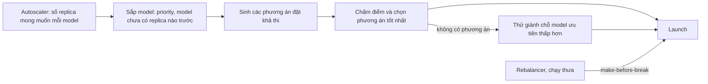

# gpupool — Thiết kế platform đa model, đa server (đã triển khai)

> Bản tiếng Việt. Bản tiếng Anh: [PLATFORM_DESIGN.en.md](PLATFORM_DESIGN.en.md). Giữ hai bản đồng bộ.

**Trạng thái: đã triển khai.** Cả bốn giai đoạn của lộ trình (mục 8) đã có trong code, cùng hai bổ sung
muộn hơn mà các câu hỏi mở của thiết kế đã đòi hỏi: tự hiệu chỉnh VRAM theo từng model và lưu bền trạng thái
điều khiển. Đây là tài liệu giải thích lý do thiết kế: vì sao hệ thống hành xử như vậy. Giao diện HTTP chính
xác nằm ở [API.vi.md](API.vi.md).

Mục tiêu: gpupool quản lý **nhiều model trên nhiều server, nhiều GPU** cùng lúc, chia tài nguyên có
chủ đích (ưu tiên, dàn trải, tự co giãn theo tải) và **gợi ý GPU/server** cho từng model kèm lý do và số
ước lượng. Tài liệu này mô tả hành vi đã thúc đẩy thiết kế, mô hình tài nguyên, thuật toán phân bổ, tóm tắt
API, thay đổi dữ liệu và lộ trình triển khai.

## 1. Mốc ban đầu: hành vi khi chạy nhiều model trước thiết kế này

Đo bằng reconciler và scheduler **thật** như trước giai đoạn 1 (agent giả, metadata GGUF thật của Qwen2.5
0.5B = 587 MB và 3B = 2191 MB ở ctx 4096). Mỗi vấn đề dưới đây về sau đã được xử lý ở mục tiếp theo.

| Tình huống | Kết quả | Vấn đề |
| --- | --- | --- |
| 2 replica của `chat`, server a: 2×8 GB, b: 1×8 GB | cả 2 replica nằm trên **a/CUDA0** | không chịu lỗi (1 GPU chết = mất cả model), 2 replica tranh nhau một GPU trong khi 2 GPU rảnh |
| `alpha` và `zeta` (3B), một GPU 4 GB chỉ đủ 1 model | `alpha` chạy, `zeta` NoFit | thắng thua theo **thứ tự tên**; không có cách khai báo model nào quan trọng hơn |
| `big` 3B + `small` 0.5B, a: 8 GB + 8 GB | cả hai trên **a/CUDA0**, CUDA1 bỏ trống | scheduler chỉ nhìn bộ nhớ; hai model cùng chạy sẽ chia đôi băng thông của một GPU |
| `small` rồi `big`, a: 3 GB + 2.4 GB | `big` → CUDA0, `small` → CUDA1 | đúng: best-fit theo bộ nhớ hoạt động tốt |

Nguyên nhân gốc, đọc từ code lúc đó:

- `Reconciler._enforce_counts` duyệt model theo `ORDER BY name`, mỗi tick một replica mỗi model. Không có
  khái niệm ưu tiên, không có giành chỗ (preemption).
- `scheduler.placement.plan` là hàm thuần chỉ thấy `usable_mb`. Nó không biết replica nào khác đang chạy
  ở đâu, không biết GPU nào nhanh hơn, không biết GPU nào đang bận. Tier `single_gpu` chọn GPU **nhỏ
  nhất còn vừa** (best-fit), nên tự nhiên dồn mọi thứ vào cùng một GPU.
- `replicas` là số cố định. Model không ai dùng vẫn giữ VRAM mãi, model quá tải không tự thêm replica.
- NoFit là tất cả hoặc không có gì: không gợi ý giảm `ctx_size`, không nói thiếu bao nhiêu, ở đâu.

## 2. Mô hình tài nguyên

Một GPU có hai loại tài nguyên, và chúng cư xử khác nhau:

| Tài nguyên | Tính chất | Nguồn số liệu | Cách dùng |
| --- | --- | --- | --- |
| VRAM | **cứng**: thiếu là không load được | `usable_mb`, ước lượng `est_mb` (`scheduler/estimate.py`), được hiệu chỉnh theo từng model bằng hệ số calibration (mục 4.7) | ràng buộc bắt buộc |
| Băng thông bộ nhớ | **mềm**: chia sẻ thì chậm đi | NVML: bus width × mem clock (đo trên GTX 1650 Ti: 128 bit × 5001 MHz ≈ 160 GB/s) | ước lượng tok/s, điểm hiệu năng |
| Mức bận | **mềm**, thay đổi theo thời gian | llama-server `/metrics`: `requests_processing`, `requests_deferred`, `predicted_tokens_seconds` (đã kiểm trên b11342); router `outstanding` | phạt khi ghép chung GPU, tín hiệu autoscale |

**Ước lượng tốc độ decode.** Sinh mỗi token phải đọc toàn bộ trọng số một lần, nên decode bị giới hạn bởi
băng thông:

```latex
t_{token} = \sum_{d \in \text{devices}} \frac{\text{bytes}_d}{BW_d \cdot \eta} + n_{rpc} \cdot t_{hop}
\qquad \text{tok/s} \approx 1 / t_{token}
```

`bytes_d` là tổng `layer_bytes` của các layer đặt trên thiết bị d (đã có trong `ModelMeta`; tensor đầu ra
tính vào thiết bị cuối). η là hiệu suất thực tế: số đo trong `TEST_REPORT` cho η ≈ 0.45 với 0.5B (182
tok/s trên lý thuyết ~400) và ≈ 0.6 với 3B (51 tok/s trên lý thuyết ~84). Code dùng hằng số **η = 0.5** và
`t_hop` = 2 ms mỗi bước nhảy RPC (`scheduler/scoring.py`). GPU chưa biết băng thông được gán giá trị mặc
định. Prefill phụ thuộc compute hơn băng thông; ước lượng chỉ xếp hạng theo decode. Tốc độ decode đo được
được đọc từ `/metrics` và hiển thị cạnh số ước lượng ở `GET /api/models/{name}/scaling`, nhưng **không**
được đưa ngược lại vào η (xem câu hỏi mở).

**Ghép chung GPU.** Hai model cùng bận trên một GPU chia nhau băng thông, mỗi model còn khoảng một nửa
tốc độ. Hai model mà một bên hầu như rảnh thì ghép được. Vì vậy hình phạt ghép chung dựa trên **mức bận
đo được**, không cấm cứng.

## 3. Chính sách cho từng model

Mọi trường đều tùy chọn và có giá trị mặc định giữ hành vi của một model số replica cố định. Bảng trường đầy
đủ, kèm kiểu và giới hạn, nằm ở [API.vi.md](API.vi.md#2-modelspec).

| Trường | Mặc định | Ý nghĩa |
| --- | --- | --- |
| `priority` | 50 | 0–100. Model ưu tiên cao được xếp trước, và khi thiếu chỗ có thể giành chỗ của model ưu tiên thấp hơn |
| `min_replicas` | = `replicas` | số replica luôn giữ (0 = cho phép dỡ khi rảnh) |
| `max_replicas` | = `replicas` | > `min_replicas` thì bật autoscale |
| `autoscale` | `{target_busy: 0.7, up_after_s: 30, down_after_s: 300}` | ngưỡng thêm/bớt replica theo tỷ lệ slot bận |
| `idle_unload_s` | null | chỉ khi `min_replicas = 0`: không có request trong N giây thì dỡ model; request đầu tiên sẽ load lại |
| `spread` | `"gpu"` | `gpu`: các replica ưu tiên khác GPU; `node`: khác server; `none`: không quan tâm |
| `pin_devices` | rỗng | các mục `"node_id/device_id"` mà replica được dùng; rỗng = chọn tự do |
| `preemptible` | true | false = không bao giờ bị giành chỗ |
| `kv_cache_type`, `speculative`, `draft`, `draft_n_max` | `f16`, `none`, null, 4 | tùy chọn bộ nhớ/tốc độ mà phần ước lượng và planner tính đến (thêm sau thiết kế này) |

`replicas` là công tắc bật/tắt: 0 là dừng model bất kể `min/max`. Khi `min_replicas` và `max_replicas` chưa
đặt thì cả hai bằng `replicas`, nên model số lượng cố định hành xử như trước.

**Quyết định không xây.** Bản nháp đầu còn đề xuất `share_gpu`, `gpu_selector` (nhãn, `min_vram_mb`,
`min_bandwidth_gbps`), **nhãn** cho server/GPU và `reserve_mb` theo từng GPU. Chúng không có trong code.
`pin_devices` đáp ứng việc đặt chỉ định rõ, và `budget_mb` theo thiết bị trên agent (đã trừ cả VRAM do chính
các replica của gpupool giữ) đáp ứng việc giữ lại VRAM cho việc khác. Nhãn chỉ nên thêm nếu xuất hiện một
cụm mà pin từng thiết bị là quá thô.

## 4. Thuật toán phân bổ



**4.1 Thứ tự.** Mỗi tick, sắp model theo `priority` giảm dần. Trong cùng mức, model **chưa có replica
nào** đi trước model đã có (để mọi model có ít nhất 1 replica rồi mới tới replica thứ hai), sau đó theo
**tên** (một tiêu chí phân định ổn định; bản nháp đầu ghi là thời gian tạo). Thứ tự tên giờ chỉ dùng để phá
hòa.

**4.2 Sinh phương án.** `scheduler/placement.py` sinh nhiều phương án khả thi thay vì một phương án mỗi
tier: mỗi GPU đơn đủ chỗ, các tổ hợp nhiều GPU trong một node, và các phương án multi-node (chỉ khi cần;
các biến thể tham lam trước, rồi các tập con theo băng thông). `plan()` trả phương án tốt nhất đã cấp cổng;
`rank()` trả top `k` không cấp cổng, được `recommend`, `simulate` và rebalance dùng. Số GPU trong một cụm
thực tế nhỏ (vài chục), nên liệt kê được. Thuật toán chia layer (`_split`) giữ nguyên. Model draft của
speculative được đặt nguyên khối trên thiết bị CUDA đầu tiên của head và tính vào `est_mb` của thiết bị đó.

**4.3 Chấm điểm.** Mỗi phương án có điểm; điểm cao thắng. Các trọng số là hằng số trong
`scheduler/placement.py`, không phải cấu hình:

```latex
\text{score} = 100 \cdot \frac{tps}{tps_{best}} - \sum_{o \in \text{engines on chosen GPUs}} (10 + 30 \cdot busy_o) - 40 \cdot same_{gpu} - 20 \cdot same_{node} - 15 \cdot waste - 5 \cdot (n_{dev}-1) - 10 \cdot n_{rpc}
```

- `tps / tps_best`: tốc độ decode ước lượng so với phương án nhanh nhất.
- Mỗi engine đã có trên GPU được chọn bị trừ 10, cộng 30 nhân mức bận (0–1) của nó.
- `same_gpu`, `same_node`: số replica cùng model đã có trên GPU / server đó (theo `spread`: `gpu` và `node`
  phạt GPU dùng chung; chỉ `node` phạt server dùng chung).
- `waste`: trung bình của `usable / usable lớn nhất` trên các GPU được chọn. Đây là cách giữ lại ưu điểm
  của best-fit: không xé nhỏ một GPU lớn khi GPU vừa khít còn trống.
- `n_dev`, `n_rpc`: số thiết bị thêm và số lần nhảy qua mạng.

Hòa điểm thì chọn tier nhỏ hơn, rồi tên thiết bị đầu tiên, nên kết quả xác định. Phương án thắng được lưu
cùng replica (`score`, `est_decode_tps`, `reasons`), để UI giải thích được vì sao model nằm ở đó.

**4.4 Giành chỗ (preemption).** Model đang dưới mức tối thiểu đang chạy (`max(min_replicas, 1)`, bị chặn bởi
số lượng mong muốn, nên replica thêm do autoscale không bao giờ đi giành) và không có phương án khả thi có
thể dừng replica của model ưu tiên thấp hơn:

1. Nạn nhân hợp lệ: replica của model `preemptible` có priority **thấp hơn hẳn** P (bằng nhau thì không
   bao giờ giành). Thứ tự: replica vượt quá mức tối thiểu đang chạy của model đó trước, rồi cái ít bận
   nhất, rồi cái mới nhất.
2. Thêm dần nạn nhân vào tập giả lập "đã gỡ" cho tới khi có phương án, rồi bỏ lại những nạn nhân hóa ra
   không cần. Kết quả là một tập nhỏ, không nhất thiết nhỏ nhất có thể.
3. Drain chúng (cơ chế `drain` hiện có: chờ request đang chạy, tối đa `drain_timeout_s`). Model đi giành
   chỗ không được đặt ngay trong cùng tick; replica đang drain vẫn giữ bộ nhớ, nên một tick sau mới đặt.
   Mỗi nạn nhân phát một event cảnh báo `preempted`.
4. **Cooldown** 10 phút theo từng model đi giành, và không gỡ thêm khi các nạn nhân trước còn đang drain, để
   hai model không giành qua giành lại.
5. **Giữ chỗ (claim).** Trong lúc model đi giành chưa có replica (tối đa `drain_timeout_s` + 120 s), model
   ưu tiên thấp hơn không được launch. Thiếu cơ chế này, model bị gỡ launch lại ngay vào phần bộ nhớ đang
   giải phóng (lỗi tìm ra trên phần cứng thật).

**4.5 Autoscaler.** Mỗi replica có `busy = requests_processing / parallel`, đọc từ `/metrics` của
llama-server mỗi `poll_s` (lần scrape cũ hơn 3 chu kỳ thì thay bằng số request đang chạy do router đếm).
`requests_deferred > 0` nghĩa là request đang phải xếp hàng.

- Tăng 1 replica khi trung bình `busy` > `target_busy`, hoặc có request xếp hàng, liên tục `up_after_s` và
  không còn replica nào đang launch. Không vượt `max_replicas`.
- Giảm 1 replica khi `busy` < `target_busy / 2` và không có request xếp hàng liên tục `down_after_s`.
  Không xuống dưới mức sàn đang chạy `max(min_replicas, 1)`: về 0 chỉ do `idle_unload_s` thực hiện.
- `idle_unload_s`: không có request trong khoảng đó và không có request đang chạy, với `min_replicas = 0`
  thì desired về 0.
- **Khởi động lạnh**: router nhận request cho model đã start có `min_replicas = 0` và chưa có replica thì
  autoscaler đặt desired = 1, phát `cold_start` và đánh thức reconciler; router giữ request tối đa
  `cold_start_timeout_s` (mặc định 120 s). Quá hạn thì trả 503 kèm `Retry-After`.
- **Lưu bền.** Số lượng desired, thời điểm request gần nhất và quyết định gần nhất được ghi vào store
  (`control_state`, khóa `autoscaler:<model>`) khi chúng đổi, nên khởi động lại vẫn giữ model đã dỡ ở trạng
  thái dỡ và model đã tăng ở trạng thái tăng. Bộ đếm thời gian tăng/giảm không được lưu: khởi động lại chỉ
  làm chậm một bước đúng bằng `up_after_s`/`down_after_s`.

**4.6 Cân bằng lại (rebalance).** Chạy thưa (mỗi `rebalance_s`, mặc định 600 s, 0 = tắt; lần chạy đầu cách
lúc khởi động một chu kỳ vì ngay sau khi khởi động các report còn cũ) hoặc theo yêu cầu
(`POST /api/rebalance`). Mục tiêu: replica nay có điểm cao hơn ít nhất 25 ở nơi khác (ví dụ model đang ở
CPU hoặc chia 2 GPU nay vừa 1 GPU); lần di chuyển nằm trong `pin_devices` của model. Cách làm là
**make-before-break**: launch replica mới (được lập kế hoạch trên các thiết bị đích trong lúc replica cũ vẫn
giữ bộ nhớ), chờ ready, rồi drain replica cũ. Mỗi lần chỉ di chuyển một replica trong cả cụm, và chỉ khi cụm
đang yên: không có replica đang launch, không có lần giành chỗ nào đang chờ bộ nhớ. Lần di chuyển mà replica
mới lỗi, hoặc không ready trong `launch_timeout_s` + 60 s, bị hủy với cảnh báo `rebalance_failed` và
replica cũ tiếp tục phục vụ.

**4.7 Tự hiệu chỉnh VRAM.** Ước lượng bộ nhớ chính xác tới từng MiB với các trường hợp đã đo trên GTX 1650,
nhưng chưa bao giờ được đo với model lớn chia nhiều GPU. Thay vì tin nó, mỗi model tự học một hệ số hiệu
chỉnh. Sau khi replica ready, coordinator đọc những gì llama.cpp đã báo lúc load
(`GET /engines/{id}/memory` trên agent của head), cộng các buffer đo được trên các thiết bị của phương án
đặt, và so với ước lượng (chia lại cho hệ số đã dùng lúc lập phương án, trừ phần context runtime mà
llama.cpp không báo). Tỷ lệ được gộp vào một hệ số
riêng của model bằng trung bình trượt mũ (trọng số 0.5) và lưu trong `model_calibration`. Khi đặt, nhu cầu
thiết bị của model được nhân với hệ số này, giới hạn trong 0.9–2.0. Event `calibrated` được phát khi hệ số
đổi hơn 5 %; mẫu có dữ liệu thiếu bị bỏ qua thay vì làm lệch hệ số. Hệ số hiển thị là `calibration` trong
`GET /api/state`.

**4.8 Lưu bền trạng thái điều khiển.** Ngoài trạng thái của autoscaler, reconciler ghi vào `control_state`
các cooldown và claim giành chỗ (`preempted`), backoff khi crash lặp (`backoff`) và lần di chuyển replica
đang diễn ra (`move`), rồi nạp lại khi khởi động. Nhờ vậy coordinator khởi động lại không quên cooldown (để
hai model lại giành nhau), không quên backoff (dồn dập model đang crash) hay quên nửa lần di chuyển (để lại
hai replica của cùng một model). Lần di chuyển mà các replica của nó không còn tồn tại được xóa lặng lẽ.
Thời gian dùng đồng hồ thật. Thời điểm rebalance lần cuối cố ý không được lưu.

## 5. Gợi ý GPU/server

Trả lời câu hỏi "model này nên chạy ở đâu?" **trước khi** deploy, với cùng bộ chấm điểm như scheduler,
nên điều được gợi ý cũng là điều scheduler sẽ làm.

- Xếp hạng tối đa `limit` phương án, mỗi phương án có VRAM dự kiến, tok/s ước lượng, điểm và lý do.
- Có đặt được ngay không, hay cần giành chỗ của ai (`requires_preemption`, liệt kê các replica cần dừng).
- Báo `ctx_size` lớn nhất vừa một GPU ngay bây giờ (`max_ctx_single_gpu`).
- Không đặt được thì nói rõ vì sao: bộ nhớ cần, GPU đơn và node trống lớn nhất, và `ctx_size` lớn nhất sẽ
  vừa (`not_possible`).

## 6. Tóm tắt API

Tài liệu tham chiếu đầy đủ, kèm dạng request và response, là [API.vi.md](API.vi.md). Mọi endpoint của thiết
kế nằm dưới `/api` và dùng admin key; các trường request mới đều tùy chọn, nên client cũ vẫn chạy.

| Khả năng | Endpoint |
| --- | --- |
| Chính sách model (mục 3, 4.5) | `PUT /api/models/{name}`, `POST .../start`, `POST .../stop`, `DELETE /api/models/{name}`, `GET .../scaling`, `POST .../plan` |
| Dung lượng và gợi ý (mục 5) | `GET /api/capacity`, `POST /api/recommend` |
| Giả lập (mục 4.4) | `POST /api/simulate`: các lần start, stop và giành chỗ mà reconciler sẽ làm với thay đổi giả định |
| Cân bằng lại (mục 4.6) | `POST /api/rebalance` (`dry_run` mặc định là true) |
| Trạng thái và event | `GET /api/state` (gồm `calibration`, `rebalance`), `GET /api/events`, `POST /api/events/read` |
| Router | khởi động lạnh của `/v1/*` trả 503 + `Retry-After` quá `cold_start_timeout_s` |

Event do thiết kế thêm: `preempted` (warning), `scaled_up`, `scaled_down`, `unloaded_idle`, `cold_start`,
`rebalance_started`, `rebalanced`, `calibrated` (info), `rebalance_failed` (warning).

Khác biệt so với bản nháp đầu: không có endpoint nhãn (`PUT /api/servers/{id}/labels`) và
`PUT .../gpus/{device_id}` chỉ nhận `enabled`; `POST /api/simulate` báo `start`, `stop`, `preempt` và
`unplaced` nhưng không có `move` (các lần di chuyển của rebalance được xem trước bằng `POST /api/rebalance`);
`not_possible` gồm `need_mb`, `largest_single_gpu_mb`, `largest_single_node_mb` và `max_ctx_that_fits`.

## 7. Thay đổi dữ liệu

- `ModelSpec`: các trường chính sách (JSON trong bảng `models`, không cần migration), về sau thêm
  `kv_cache_type`, `speculative`, `draft`, `draft_n_max`.
- `Device`: `bandwidth_gbps` (agent đọc từ NVML), `uuid`, `budget_mb`. Agent cũ không gửi thì coi như bằng
  nhau.
- `Placement`: `score`, `est_decode_tps`, `reasons`, `draft_est_mb`.
- `gpu_flags` được khóa theo uuid của card khi có báo cáo. Không có bảng `server_labels` và không có cột
  `labels`/`reserve_mb` (xem mục 3).
- Bảng `control_state(key, value, updated_at)`: trạng thái autoscaler theo từng model, `preempted`,
  `backoff`, `move`.
- Bảng `model_calibration(model, factor, samples, updated_at)`.
- Thời điểm request gần nhất của từng model nằm trong autoscaler (lưu với nhịp chậm); router chỉ báo request
  cho nó.

## 8. Lộ trình

| Giai đoạn | Nội dung | Rủi ro | Trạng thái |
| --- | --- | --- | --- |
| 1. Nền tảng | `priority` và thứ tự công bằng; `spread`; phạt ghép chung GPU bận; `bandwidth_gbps` + ước lượng tok/s; sinh phương án + chấm điểm; `GET /api/capacity`; `POST /api/recommend`; panel gợi ý trong form "New model" | thấp: không gỡ replica nào đang chạy | xong |
| 2. Co giãn | đọc `/metrics` của llama-server; `min/max_replicas` + autoscaler; `idle_unload_s` + khởi động lạnh ở router; `GET /scaling` | trung bình: thêm/bớt replica tự động | xong |
| 3. Giành chỗ | preemption + cooldown + claim; `POST /api/simulate` | trung bình: gỡ replica đang phục vụ, cần drain đúng | xong |
| 4. Cân bằng lại | rebalance make-before-break; `POST /api/rebalance` | cao nhất: load lại model lớn tốn thời gian | xong |
| Sau 4 | tự hiệu chỉnh VRAM (4.7); lưu bền trạng thái điều khiển (4.8) | thấp | xong |

**Trạng thái giai đoạn 1:** xong. Chạy thật trên GTX 1650: model `priority` 80 thắng model có tên đứng trước; replica và model mới dàn sang GPU khác (mô phỏng với scheduler thật); tok/s ước lượng 41.6 so với đo thật 51.8 (model 3B) và 204 so với 182 (0.5B). `budget_mb` giờ trừ cả VRAM do chính các replica của gpupool đang giữ. Chưa có cụm thật nhiều GPU để kiểm phần dàn replica trên phần cứng.

**Trạng thái giai đoạn 2:** xong. Chạy thật trên GTX 1650: model 3B ở chế độ theo yêu cầu tự dỡ sau 20 s không có request, request tiếp theo khởi động lạnh và nhận trả lời sau 2.9 s; model 0.5B (min 1, max 2) có request xếp hàng thì lên 2 replica sau khoảng 9 s, 82 request chia 49/33 cho hai replica, hết tải 16 s thì về 1. Lúc đo, trạng thái autoscale chỉ nằm trong bộ nhớ và coordinator khởi động lại thì mọi model quay về mức tối thiểu đang chạy; nay đã được lưu bền (4.5, 4.8).

**Trạng thái giai đoạn 3:** xong. Chạy thật trên GTX 1650 (budget 2500 MB): `/api/simulate` báo trước đúng việc sẽ gỡ `q05` (priority 20) để chạy `q3b` (priority 80), `/api/recommend` trả phương án `fits_now: false` kèm replica cần gỡ, và khi `q05` không cho giành chỗ thì báo `q3b` không đặt được. Giành chỗ thật: `q3b` chạy 23.5 s sau lệnh start, `q05` không giành lại được. Lần chạy đầu lộ ra một lỗi: replica bị gỡ chuyển sang draining nên model của nó launch lại ngay vào phần bộ nhớ đang giải phóng. Đã sửa bằng một khoảng giữ chỗ: trong lúc model giành chỗ chưa có replica (tối đa `drain_timeout_s` + 120 s), model ưu tiên thấp hơn không được launch.

**Trạng thái giai đoạn 4:** xong. Chạy thật với hai agent trên một máy (a: GPU giới hạn 1000 MB, b: chỉ CPU): replica `y` đang chạy trên b/CPU (~30 tok/s ước lượng) được chuyển sang a/CUDA0 (~204 tok/s) khi GPU rảnh, điểm +100, mất khoảng 9.5 s. Trong lúc chuyển, một client gửi liên tục 23 request và không request nào lỗi. Sau khi chuyển, kiểm tra lại không còn đề xuất nào. Chạy định kỳ theo `rebalance_s` (mặc định 600 s, 0 = tắt).

Mỗi giai đoạn được kiểm trên cụm thật, ít nhất 2 server và 2 model, trước khi sang giai đoạn sau.

## 9. Câu hỏi mở và các quyết định

Đã quyết định:

- **Độ chính xác của ước lượng VRAM với model lớn chia nhiều GPU.** Không đo thủ công; thay vào đó mỗi
  model tự hiệu chỉnh theo những gì llama.cpp thực sự cấp phát (4.7). Ước lượng vẫn là điểm xuất phát, hệ số
  đo được sửa nó theo từng model.
- **Nhãn, `share_gpu`, `gpu_selector`, `reserve_mb`.** Không xây (mục 3).
- **Hành vi khi khởi động lại.** Trạng thái điều khiển được lưu bền (4.8); chỉ bộ đếm rebalance cố ý khởi
  động lại.

Vẫn còn mở:

- **η theo kiến trúc GPU.** Số hiện có chỉ từ một GTX 1650 và code dùng η = 0.5 cố định. Tốc độ decode đo
  được đã được thu thập, nên có thể tự hiệu chỉnh η theo từng model, nhưng chưa triển khai. GPU datacenter
  có thể khác nhiều, nên cần làm trước khi dựa vào xếp hạng tok/s ở đó.
- **Hiệu chỉnh trên model lớn.** Cơ chế đã có, nhưng chưa chạy một model ≥ 7B thật chia nhiều GPU qua nó;
  mức kẹp 0.9–2.0 và trọng số 0.5 chưa được chỉnh.
- **Prefill** bị giới hạn bởi compute (SM × clock), không phải băng thông. Model chủ yếu nhận prompt dài
  có thể cần một điểm hiệu năng riêng.
- **Trọng số chấm điểm** ở mục 4.3 là điểm khởi đầu, là hằng số trong code, cần chỉnh theo số đo thật.
- **Dàn replica và rebalance trên phần cứng thật nhiều GPU, nhiều server** mới chỉ được kiểm với agent giả
  lập và một máy một GPU.
